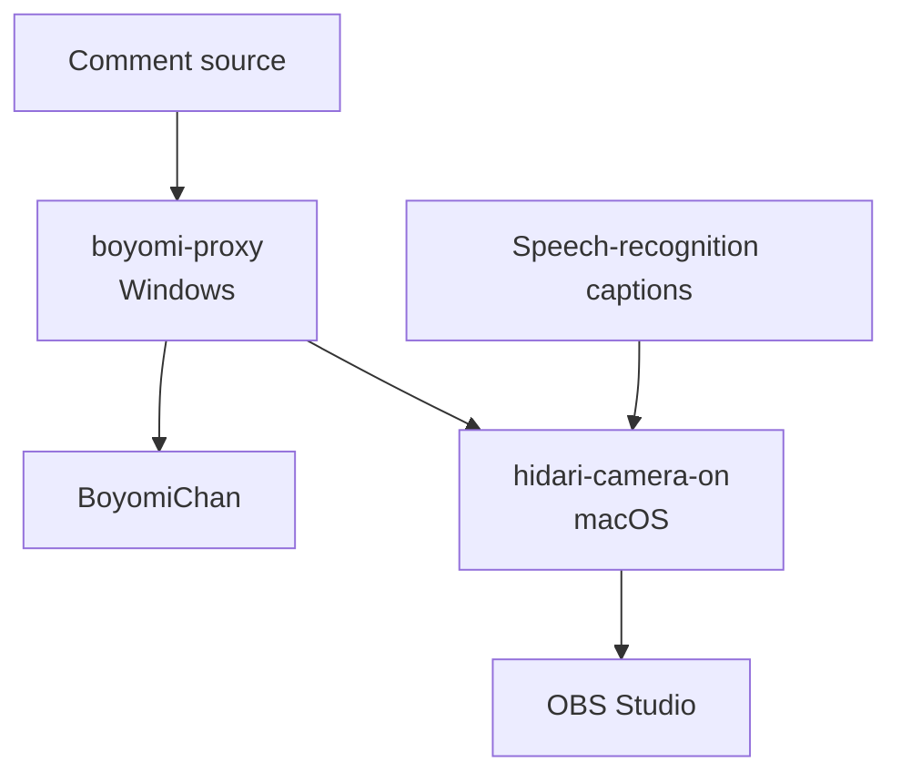

# himahima-hidari-camera-on

[日本語](./README.md)

A set of tools that automatically controls a left-camera view in OBS Studio when a matching live-stream comment or speech-recognition result is received.

This repository contains `boyomi-proxy`, which exposes a BoyomiChan-compatible API on Windows, and `hidari-camera-on`, which receives comment and speech-recognition events on macOS and controls OBS Studio.

## Features

- Proxies the BoyomiChan-compatible API
  - `GET /talk`
  - `GET /pause`
  - `GET /resume`
- Forwards comments received by `GET /talk` to macOS asynchronously
- Detects the “turn on the left camera” keyword in comments and speech-recognition results
- Controls OBS Studio directly through OBS WebSocket Version 5
- Uses a 30-second display timer and extends it when the same source triggers again
- Suppresses duplicate triggers across comments and speech recognition
- Automatically reconnects when the OBS Studio connection is lost
- Restricts source IP addresses and applies Bearer-token authentication and rate limiting
- Writes logs to the console and daily rolling files through Serilog
- Includes xUnit tests for core logic

## Architecture



| Component | Environment | Responsibility |
| -- | -- | -- |
| `boyomi-proxy` | Windows 11 Arm virtual machine | Exposes the BoyomiChan-compatible API and forwards comments |
| `hidari-camera-on` | macOS on Apple Silicon | Receives API calls, evaluates triggers, controls OBS Studio, and manages display duration |
| `hidari-camera-on.Tests` | Any compatible .NET environment | Unit tests for normalization, trigger matching, authentication, and related logic |
| Speech-recognition captions | Web browser, separate project | Sends finalized speech-recognition text |

## Requirements

### Required software and environment

- .NET 10 Software Development Kit (SDK)
- OBS Studio
- OBS WebSocket Version 5
- An Apple Silicon Mac
- A Windows 11 Arm environment
- BoyomiChan or an application that exposes a compatible API

### Default publish targets

| Project | Runtime Identifier | Self-contained | Single file |
| -- | -- | --: | --: |
| `boyomi-proxy` | `win-arm64` | Yes | Yes |
| `hidari-camera-on` | `osx-arm64` | Yes | Yes |

## Setup

### (1) Clone the repository

```sh
git clone https://github.com/SKAsApp/himahima-hidari-camera-on.git
cd ./himahima-hidari-camera-on
```

### (2) Create secret files

Do not commit real tokens or passwords. Copy each `.example` file and replace its placeholder value.

#### boyomi-proxy

```sh
cp ./boyomi-proxy/token/comment-api-token.txt.example ./boyomi-proxy/token/comment-api-token.txt
```

Write the token used by the `hidari-camera-on` comment API as a single line in `boyomi-proxy/token/comment-api-token.txt`.

#### hidari-camera-on

```sh
cp ./hidari-camera-on/token/comment-api-token.txt.example ./hidari-camera-on/token/comment-api-token.txt
cp ./hidari-camera-on/token/speech-api-token.txt.example ./hidari-camera-on/token/speech-api-token.txt
cp ./hidari-camera-on/token/obs-websocket-password.txt.example ./hidari-camera-on/token/obs-websocket-password.txt
```

Write the following value as a single line in each file.

| File | Content |
| -- | -- |
| `comment-api-token.txt` | Bearer token for the comment API |
| `speech-api-token.txt` | Bearer token for the speech-recognition API |
| `obs-websocket-password.txt` | OBS WebSocket password |

Use the same value in the `comment-api-token.txt` files for `boyomi-proxy` and `hidari-camera-on`.

### (3) Configure OBS Studio

1. Enable OBS WebSocket in OBS Studio.
2. Set a password.
3. Place the left camera, frame, captions, and related sources in one group.
4. Set `SceneName` and `SourceName` in `hidari-camera-on/appsettings.json` to the names used in OBS Studio.
5. Change `ObsWebSocket.Uri` if necessary. Its default value is `ws://127.0.0.1:4455`.

### (4) Configure the applications

#### boyomi-proxy/appsettings.json

| Setting | Default | Description |
| -- | -- | -- |
| `Server.ListenHost` | `localhost` | API listen host |
| `Server.ListenPort` | `15080` | API listen port |
| `Boyomi.Host` | `localhost` | BoyomiChan host |
| `Boyomi.Port` | `40080` | BoyomiChan port |
| `HidariCameraApi.Url` | `http://10.37.129.2:15082/api/v1/comments` | Comment API on macOS |
| `HidariCameraApi.QueueCapacity` | `360` | Asynchronous forwarding queue capacity |
| `RateLimit.PermitLimit` | `20` | Requests permitted in one window |

#### hidari-camera-on/appsettings.json

| Setting | Default | Description |
| -- | -- | -- |
| `Server.ListenHost` | `0.0.0.0` | API listen host |
| `Server.ListenPort` | `15082` | API listen port |
| `Camera.DisplaySeconds` | `30` | Left-camera display duration |
| `ObsWebSocket.Uri` | `ws://127.0.0.1:4455` | OBS WebSocket endpoint |
| `ObsWebSocket.SceneName` | `車載配信` | Target scene name |
| `ObsWebSocket.SourceName` | `左カメラ` | Target group or source name |
| `ObsWebSocket.ReconnectIntervalSeconds` | `15` | Reconnection interval |
| `RateLimit.PermitLimit` | `20` | Requests permitted in one window |

## Build and run

### Run in a development environment

Start the macOS application first.

```sh
dotnet run --project ./hidari-camera-on/hidari-camera-on.csproj
```

Then start `boyomi-proxy` on Windows.

```sh
dotnet run --project ./boyomi-proxy/boyomi-proxy.csproj
```

### Publish

```sh
dotnet publish ./boyomi-proxy/boyomi-proxy.csproj --configuration Release
dotnet publish ./hidari-camera-on/hidari-camera-on.csproj --configuration Release
```

Each project file defines a self-contained, single-file publish target and its Runtime Identifier.

## API

### boyomi-proxy

The default base URL is `http://localhost:15080`.

| Method | Path | Description |
| -- | -- | -- |
| `GET` | `/talk?text=...` | Forwards speech to BoyomiChan and enqueues the comment for the macOS API |
| `GET` | `/pause` | Pauses speech |
| `GET` | `/resume` | Resumes speech |

Example:

```sh
curl --get --data-urlencode 'text=左カメラON' http://127.0.0.1:15080/talk
```

### hidari-camera-on

The default base URL is `http://127.0.0.1:15082`.

| Method | Path | Authentication | Description |
| -- | -- | -- | -- |
| `POST` | `/api/v1/comments` | Comment Bearer token | Receives a comment and evaluates its trigger |
| `POST` | `/api/v1/speech-recognition` | Speech Bearer token | Receives finalized speech-recognition text and evaluates its trigger |
| `GET` | `/health` | None | Returns application status and version |

Health check:

```sh
curl --request GET http://127.0.0.1:15082/health
```

Comment API:

```sh
curl --request POST \
  --header 'Authorization: Bearer comment-api-token' \
  --header 'Content-Type: application/json' \
  --data '{
    "requestId": "11111111-1111-4111-8111-111111111111",
    "source": "boyomi-proxy",
    "eventType": "talk",
    "text": "左カメラON",
    "receivedAt": "2026-09-18T07:00:00+09:00",
    "sessionId": null
  }' \
  http://127.0.0.1:15082/api/v1/comments
```

Speech-recognition API:

```sh
curl --request POST \
  --header 'Authorization: Bearer speech-api-token' \
  --header 'Content-Type: application/json' \
  --data '{
    "requestId": "55555555-5555-4555-8555-555555555555",
    "source": "speech-recognition-telop",
    "eventType": "speechRecognition",
    "text": "左カメラオン",
    "receivedAt": "2026-09-18T07:00:00+09:00",
    "sessionId": "aaaaaaaa-aaaa-4aaa-8aaa-aaaaaaaaaaaa"
  }' \
  http://127.0.0.1:15082/api/v1/speech-recognition
```

## Trigger rules

### Comments

Comments are normalized with Unicode Normalization Form KC, converted to uppercase where applicable, and processed for selected Japanese spelling variants. A trigger occurs only when the result exactly matches `左カメラON`.

Examples that trigger:

- `左カメラON`
- `左カメラon`
- `左カメラＯＮ`
- `左カメラオン`
- `ひだりカメラオン`

Spaces, punctuation, and particles are not removed, so `左カメラ ON` and `左カメラをON` do not trigger.

### Speech recognition

For speech recognition, spaces and selected punctuation are removed. A trigger occurs when one of the following conditions is met:

- The current finalized text contains `左カメラON`
- The current finalized text contains the likely recognition variant `左カメラ音`
- The end of the previous text and the beginning of the current text in the same session combine to form `左カメラON`

## Display duration and duplicate handling

- The first trigger enables the target scene item and disables it after 30 seconds by default.
- Another trigger from the same source extends the display duration.
- A trigger from a different source while the item is displayed is treated as a duplicate and does not extend the duration.
- Manually hiding the item in OBS Studio while it is being managed ends the current display session.
- Manually showing the item while the application is idle does not start an automatic timer.

## Security notes

- This system is designed for use within a private network.
- API traffic uses unencrypted HTTP by default. Do not expose the APIs directly to the internet.
- Never commit real tokens or the OBS WebSocket password.
- `hidari-camera-on` accepts connections only from loopback and private IPv4 address ranges.
- Do not write Bearer tokens, Authorization headers, or the OBS WebSocket password to logs.
- If a token is embedded in the speech-recognition web client, it cannot be treated as a protected secret.

## Tests

```sh
dotnet test ./hidari-camera-on.Tests/hidari-camera-on.Tests.csproj
```

The current test suite covers:

- Request identifier and timestamp validation
- Exact comment matching
- Single-result and split-result speech matching
- Unicode and spelling-variant normalization
- Speech-recognition session management
- Secret-file loading
- OBS WebSocket authentication-string generation

## Logging

Each application writes daily rolling log files under its `log/` directory and retains them for 31 days by default. Logs are also written to the console.

## Repository layout

```text
.
├── boyomi-proxy/
├── hidari-camera-on/
├── hidari-camera-on.Tests/
└── documetns/
```

The `documetns/` directory contains the high-level design, detailed design, migration plan, coding conventions, and sample verification requests.

## Known limitations

- The speech-recognition caption client itself is not included in this repository.
- Trigger requests cannot be processed while the configured OBS Studio scene or source cannot be found.
- Concurrent speech-recognition requests may arrive out of order and cause a split keyword to be missed.
- The direct OBS WebSocket implementation may require updates when the protocol changes.
- Browser support for requests from an HTTPS page to a loopback HTTP API varies and must be tested on the target devices.
