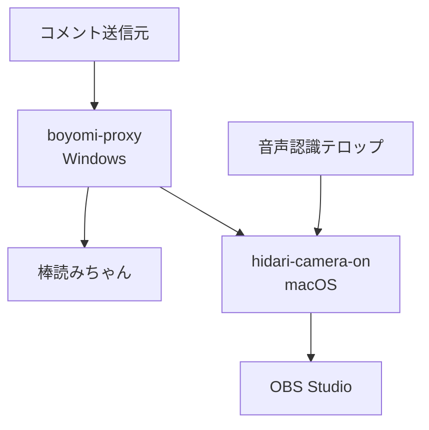

# himahima-hidari-camera-on

[English](./README.en.md)

車載配信中のコメントまたは音声認識結果をきっかけに、OBS Studioの左カメラ表示を自動制御するツール群です。

このリポジトリーには、Windows側で棒読みちゃん互換APIを提供する `boyomi-proxy` と、macOS側でコメント・音声認識APIを受け付け、OBS Studioを操作する `hidari-camera-on` が含まれています。

## 主な機能

- 棒読みちゃん互換APIの中継
  - `GET /talk`
  - `GET /pause`
  - `GET /resume`
- `GET /talk` で受信したコメントをmacOS側へ非同期転送
- コメントおよび音声認識結果から「左カメラON」を検出
- OBS WebSocket Version 5を使用したOBS Studioの直接操作
- 左カメラ表示の30秒タイマーと、同一入力元による再発動時の延長
- コメントと音声認識の重複発動抑止
- OBS Studio切断時の自動再接続
- 接続元IPアドレス制限、Bearerトークン認証、レート制限
- Serilogによるコンソールおよび日次ローリングファイルへのログ出力
- xUnitによる主要ロジックの単体テスト

## システム構成



| コンポーネント | 実行環境 | 役割 |
| -- | -- | -- |
| `boyomi-proxy` | Windows 11 Arm仮想マシン | 棒読みちゃん互換APIの提供、コメントの中継 |
| `hidari-camera-on` | macOS Apple Silicon | API受付、発動判定、OBS Studio制御、表示時間管理 |
| `hidari-camera-on.Tests` | .NET対応環境 | 文字列正規化、発動判定、認証などの単体テスト |
| 音声認識テロップ | Webブラウザー、別プロジェクト | 確定済み音声認識文字列の送信 |

## 動作環境

### 必須

- .NET 10 Software Development Kit（SDK）
- OBS Studio
- OBS WebSocket Version 5
- Apple Silicon搭載Mac
- Windows 11 Arm環境
- 棒読みちゃん、または互換APIを提供するアプリケーション

### 既定の発行先

| プロジェクト | Runtime Identifier | 自己完結型 | 単一ファイル |
| -- | -- | --: | --: |
| `boyomi-proxy` | `win-arm64` | 有効 | 有効 |
| `hidari-camera-on` | `osx-arm64` | 有効 | 有効 |

## セットアップ

### (1) リポジトリーを取得する

```sh
git clone https://github.com/SKAsApp/himahima-hidari-camera-on.git
cd ./himahima-hidari-camera-on
```

### (2) 秘密情報ファイルを作成する

実際のトークンやパスワードはリポジトリーへコミットしないでください。各 `.example` ファイルをコピーし、値を書き換えます。

#### boyomi-proxy

```sh
cp ./boyomi-proxy/token/comment-api-token.txt.example ./boyomi-proxy/token/comment-api-token.txt
```

`boyomi-proxy/token/comment-api-token.txt` に、`hidari-camera-on` のコメントAPIで使用するトークンを1行で記載します。

#### hidari-camera-on

```sh
cp ./hidari-camera-on/token/comment-api-token.txt.example ./hidari-camera-on/token/comment-api-token.txt
cp ./hidari-camera-on/token/speech-api-token.txt.example ./hidari-camera-on/token/speech-api-token.txt
cp ./hidari-camera-on/token/obs-websocket-password.txt.example ./hidari-camera-on/token/obs-websocket-password.txt
```

それぞれ次の値を1行で記載します。

| ファイル | 内容 |
| -- | -- |
| `comment-api-token.txt` | コメントAPI用Bearerトークン |
| `speech-api-token.txt` | 音声認識API用Bearerトークン |
| `obs-websocket-password.txt` | OBS WebSocketのパスワード |

`boyomi-proxy` と `hidari-camera-on` の `comment-api-token.txt` には、同じトークンを設定してください。

### (3) OBS Studioを設定する

1. OBS StudioでOBS WebSocketを有効にします。
2. パスワードを設定します。
3. 左カメラ、枠、テキストなどを一つのグループへまとめます。
4. `hidari-camera-on/appsettings.json` の `SceneName` と `SourceName` を、OBS Studio上の名前へ合わせます。
5. 必要に応じて `ObsWebSocket.Uri` を変更します。既定値は `ws://127.0.0.1:4455` です。

### (4) アプリケーション設定を変更する

#### boyomi-proxy/appsettings.json

主な設定項目は次のとおりです。

| 設定 | 既定値 | 説明 |
| -- | -- | -- |
| `Server.ListenHost` | `localhost` | APIの待受ホスト |
| `Server.ListenPort` | `15080` | APIの待受ポート |
| `Boyomi.Host` | `localhost` | 棒読みちゃんのホスト |
| `Boyomi.Port` | `40080` | 棒読みちゃんのポート |
| `HidariCameraApi.Url` | `http://10.37.129.2:15082/api/v1/comments` | macOS側のコメントAPI |
| `HidariCameraApi.QueueCapacity` | `360` | 非同期送信キュー容量 |
| `RateLimit.PermitLimit` | `20` | ウィンドウ内の許可要求数 |

#### hidari-camera-on/appsettings.json

| 設定 | 既定値 | 説明 |
| -- | -- | -- |
| `Server.ListenHost` | `0.0.0.0` | APIの待受ホスト |
| `Server.ListenPort` | `15082` | APIの待受ポート |
| `Camera.DisplaySeconds` | `30` | 左カメラの表示秒数 |
| `ObsWebSocket.Uri` | `ws://127.0.0.1:4455` | OBS WebSocketの接続先 |
| `ObsWebSocket.SceneName` | `車載配信` | 対象シーン名 |
| `ObsWebSocket.SourceName` | `左カメラ` | 対象グループまたはソース名 |
| `ObsWebSocket.ReconnectIntervalSeconds` | `15` | 再接続間隔 |
| `RateLimit.PermitLimit` | `20` | 1ウィンドウ当たりの許可要求数 |

## ビルドと実行

### 開発環境で実行する

macOS側を先に起動します。

```sh
dotnet run --project ./hidari-camera-on/hidari-camera-on.csproj
```

次にWindows側で `boyomi-proxy` を起動します。

```sh
dotnet run --project ./boyomi-proxy/boyomi-proxy.csproj
```

### 発行する

```sh
dotnet publish ./boyomi-proxy/boyomi-proxy.csproj --configuration Release
dotnet publish ./hidari-camera-on/hidari-camera-on.csproj --configuration Release
```

各プロジェクトファイルには、自己完結型、単一ファイル、および対象Runtime Identifierが設定されています。

## API

### boyomi-proxy

既定のベースURLは `http://localhost:15080` です。

| メソッド | パス | 説明 |
| -- | -- | -- |
| `GET` | `/talk?text=...` | 棒読みちゃんへ読み上げ要求を転送し、コメントAPI送信キューへ追加 |
| `GET` | `/pause` | 読み上げを一時停止 |
| `GET` | `/resume` | 読み上げを再開 |

例:

```sh
curl --get --data-urlencode 'text=左カメラON' http://127.0.0.1:15080/talk
```

### hidari-camera-on

既定のベースURLは `http://127.0.0.1:15082` です。

| メソッド | パス | 認証 | 説明 |
| -- | -- | -- | -- |
| `POST` | `/api/v1/comments` | コメント用Bearerトークン | コメントの受付と発動判定 |
| `POST` | `/api/v1/speech-recognition` | 音声認識用Bearerトークン | 確定済み音声認識文字列の受付と発動判定 |
| `GET` | `/health` | 不要 | 稼働状態とバージョンの取得 |

ヘルスチェック:

```sh
curl --request GET http://127.0.0.1:15082/health
```

コメントAPI:

```sh
curl --request POST \
  --header 'Authorization: Bearer comment-api-token' \
  --header 'Content-Type: application/json' \
  --data '{
    "requestId": "11111111-1111-4111-8111-111111111111",
    "source": "boyomi-proxy",
    "eventType": "talk",
    "text": "左カメラON",
    "receivedAt": "2026-09-18T07:00:00+09:00",
    "sessionId": null
  }' \
  http://127.0.0.1:15082/api/v1/comments
```

音声認識API:

```sh
curl --request POST \
  --header 'Authorization: Bearer speech-api-token' \
  --header 'Content-Type: application/json' \
  --data '{
    "requestId": "55555555-5555-4555-8555-555555555555",
    "source": "speech-recognition-telop",
    "eventType": "speechRecognition",
    "text": "左カメラオン",
    "receivedAt": "2026-09-18T07:00:00+09:00",
    "sessionId": "aaaaaaaa-aaaa-4aaa-8aaa-aaaaaaaaaaaa"
  }' \
  http://127.0.0.1:15082/api/v1/speech-recognition
```

## 発動条件

### コメント

コメントはUnicode正規化Form KC、英字の大文字化、および一部の表記揺れ変換を行った後、`左カメラON` と完全一致した場合に発動します。

発動例:

- `左カメラON`
- `左カメラon`
- `左カメラＯＮ`
- `左カメラオン`
- `ひだりカメラオン`

空白、句読点、助詞は削除しないため、`左カメラ ON` や `左カメラをON` は発動しません。

### 音声認識

音声認識では空白と指定の句読点を削除し、次のいずれかで発動します。

- 今回の確定文字列に `左カメラON` が含まれる
- 今回の確定文字列に誤認識候補 `左カメラ音` が含まれる
- 同じセッションの前回末尾と今回先頭を連結すると `左カメラON` が完成する

## 表示時間と重複処理

- 初回発動時に対象シーンアイテムを有効化し、既定で30秒後に無効化します。
- 同じ入力元から再発動した場合は表示時間を延長します。
- コメントと音声認識など、異なる入力元から表示中に再発動した場合は重複として扱い、表示時間を延長しません。
- 表示中にOBS Studioで手動非表示にした場合、現在の表示管理を終了します。
- 待機中に手動表示した場合、自動タイマーは設定しません。

## セキュリティー上の注意

- 本システムはプライベートネットワーク内での利用を前提としています。
- API通信は既定でHTTPのため暗号化されません。インターネットへ直接公開しないでください。
- 実トークンおよびOBS WebSocketパスワードをGitへ登録しないでください。
- `hidari-camera-on` はループバックおよびプライベートIPv4アドレスからの接続だけを許可します。
- Bearerトークン、Authorizationヘッダー、OBS WebSocketパスワードをログへ出力しないでください。
- 音声認識テロップ側へトークンを埋め込む場合、その値を秘密として保護できない点に注意してください。

## テスト

```sh
dotnet test ./hidari-camera-on.Tests/hidari-camera-on.Tests.csproj
```

現在のテストには、次の確認が含まれます。

- API要求の識別子と日時の検証
- コメントの完全一致判定
- 音声認識の単一入力および分割入力判定
- Unicodeと表記揺れの正規化
- 音声認識セッション管理
- トークンファイルの読み込み
- OBS WebSocket認証文字列の生成

## ログ

ログは各アプリケーションの `log/` ディレクトリーへ日次ローリングで保存され、既定で31日間保持されます。コンソールにも同時に出力されます。

## リポジトリー構成

```text
.
├── boyomi-proxy/
├── hidari-camera-on/
├── hidari-camera-on.Tests/
└── documetns/
```

`documetns/` には基本設計書、詳細設計書、改修方針書、コーディング規約、および動作確認用リクエストが含まれています。

## 既知の制約

- 音声認識テロップ本体はこのリポジトリーに含まれていません。
- OBS Studioの対象シーンまたはソースが見つからない間は、発動要求を処理できません。
- 音声認識要求が並行送信される場合、到着順が入れ替わり、分割キーワードを検出できないことがあります。
- OBS WebSocketプロトコルの変更時は、直接実装部分の追従が必要です。
- HTTPSページからHTTPループバックAPIへの接続可否はブラウザーによって異なるため、実機確認が必要です。
