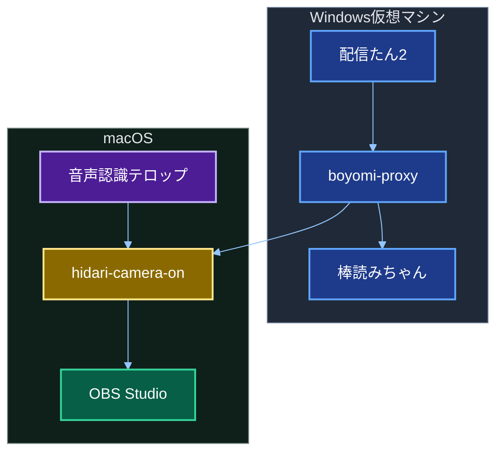
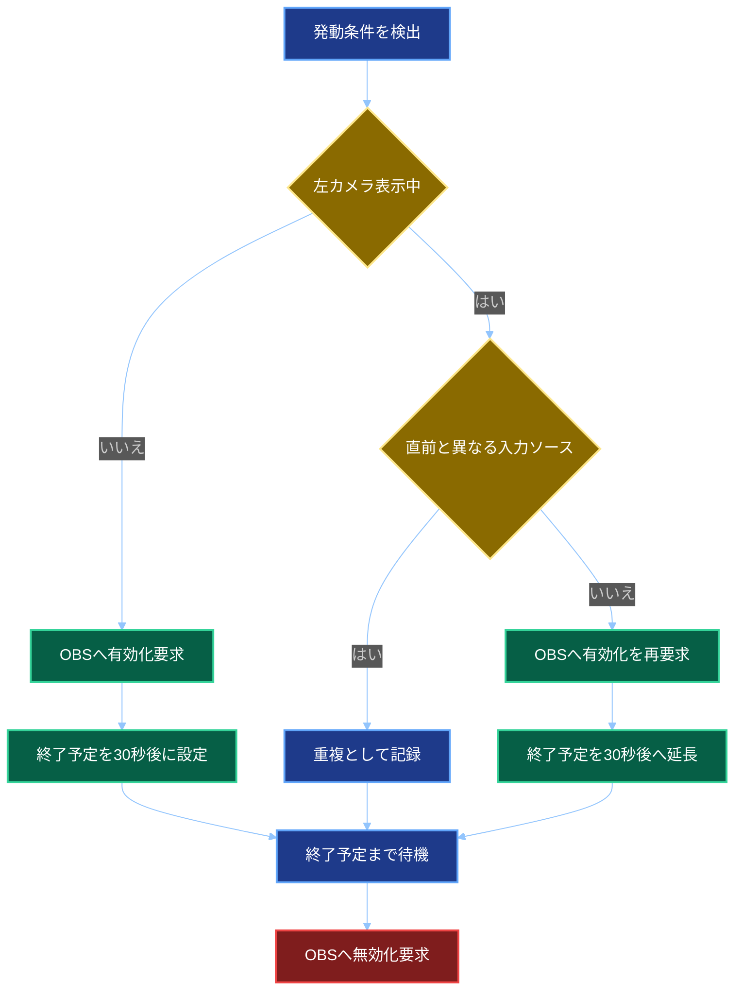
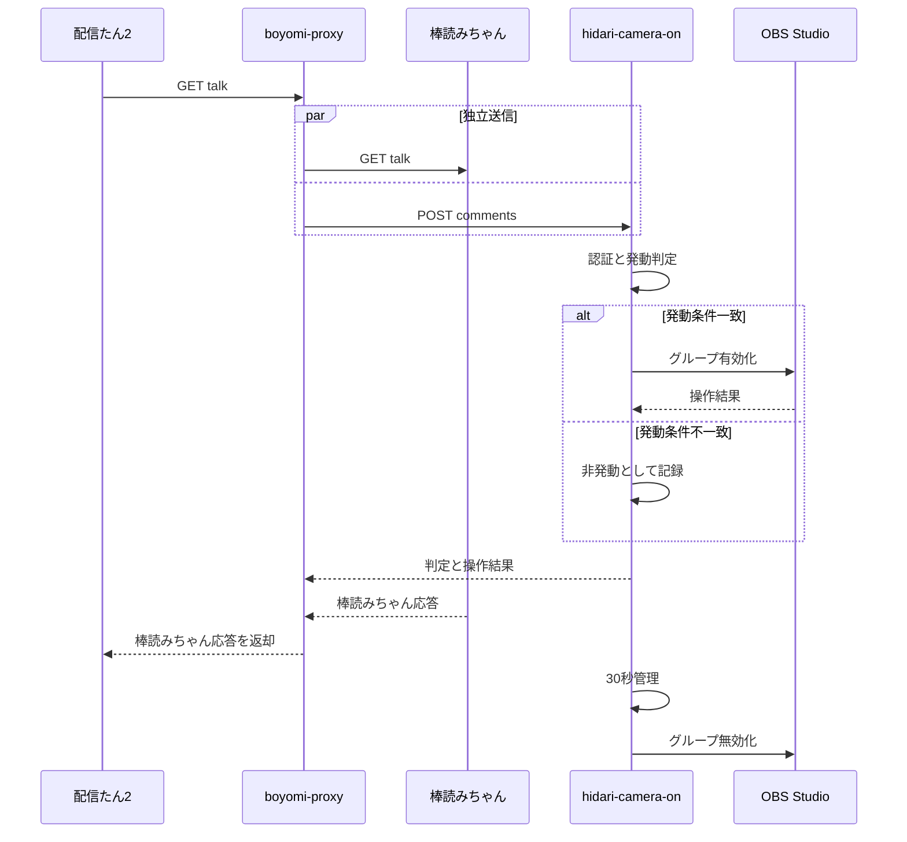
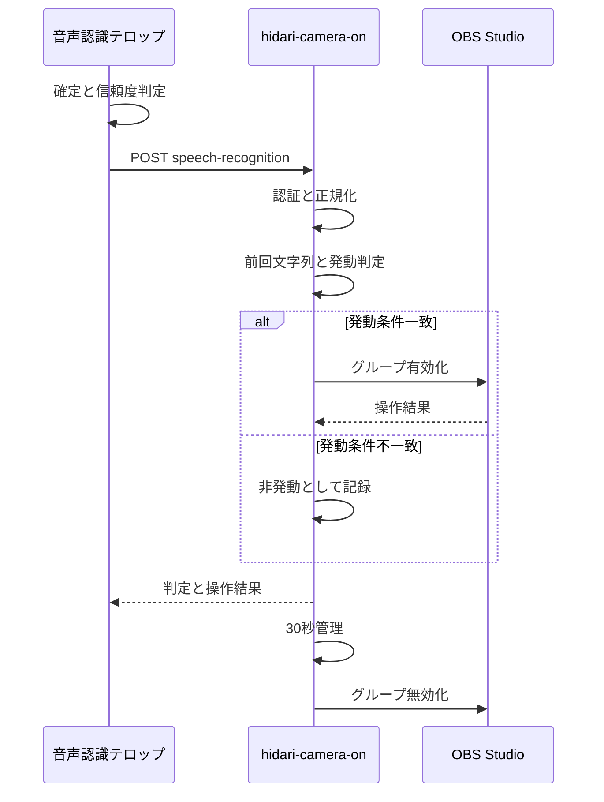

# 左カメラONにするやつ2　全体基本設計書

## 1. 文書情報

| 項目 | 内容 |
| -- | -- |
| 文書名 | 左カメラONにするやつ2　全体基本設計書 |
| 対象プロジェクト | boyomi-proxy、speech-recognition-telop、hidari-camera-on |
| 対象環境 | Windows 11 Arm上のWindows仮想マシン、macOS 26 Apple Silicon |
| 開発基盤 | .NET 10、TypeScript、JavaScript |
| 作成日 | 2026年9月1日 |
| 文書状態 | 初版レビュー依頼版 |

## 2. 目的

本システムは、車載配信中に次のいずれかを検出した場合、OBS Studio内の左カメラ表示グループを30秒間有効化することを目的とする。

- コメントビューワーで受信したコメントが、定義済みの発動条件と一致した場合
- 音声認識テロップで確定した文字列が、定義済みの発動条件と一致した場合

既存のWindows向けアプリが行っている棒読みちゃん互換APIの中継機能は維持し、OBS Studio操作をmacOS側の新規アプリへ分離する。OBS Studioの操作には仮想キー入力を使用せず、OBS WebSocketを使用する。

## 3. 対象範囲

### 3.1 対象システム

| システム | 種別 | 実行環境 | 対応概要 |
| -- | -- | -- | -- |
| boyomi-proxy | 既存改修 | Windows 11 Arm上のWindows仮想マシン | 棒読みちゃん互換APIの維持、コメントのMac側への転送 |
| speech-recognition-telop | 既存改修 | macOS上のWebブラウザー | 通常版から確定済み音声認識文字列をMac側へ送信 |
| hidari-camera-on | 新規 | macOS 26 Apple Silicon | API受付、発動判定、OBS Studio制御、30秒管理 |
| OBS Studio | 外部アプリ | macOS 26 Apple Silicon | 左カメラ表示グループの表示・非表示 |
| 配信たん2 | 外部アプリ | Windows仮想マシン | boyomi-proxyへ棒読みちゃん互換APIを要求 |
| 棒読みちゃん | 外部アプリ | Windows仮想マシン | 読み上げ、一時停止、再開 |

### 3.2 対象外

- 設定用Graphical User Interface
- macOSメニューバー常駐機能
- 複数OBS Studioインスタンスへの接続
- 複数カメラの制御
- インターネット越しのAPI利用
- コメントおよび音声認識履歴のデータベース保存
- OBS Studioのシーンまたはソースの自動作成
- アプリケーションの自動更新
- Firefoxにおける音声認識機能自体の動作保証

## 4. 前提条件

- 新規開発および改修後のC#アプリケーションは.NET 10を使用する。
- Windows仮想マシンからmacOSへの通信が可能である。
- Windows側から見たmacOSの既定IPアドレスは`10.37.129.2`である。
- Mac側IPアドレスおよびポート番号はboyomi-proxyの設定ファイルで変更可能とする。
- 配信たん2は`localhost`上の棒読みちゃん互換APIにのみ接続する。
- WindowsとmacOSの間、およびブラウザーとMac側アプリの間はHTTPを使用する。
- OBS StudioではOBS WebSocketを有効にし、パスワード認証を設定する。
- OBS Studio内では、左カメラ、枠、テキストを一つのグループにまとめる。
- 通常の配信中に対象シーンが切り替わる運用は想定しない。

## 5. システム構成



## 6. 役割分担

### 6.1 boyomi-proxy

- 配信たん2に対し、既存と互換性のある棒読みちゃん互換APIを提供する。
- `GET /talk`、`GET /pause`、`GET /resume`の既存動作を維持する。
- `GET /talk`で受信した本文を検査せず、棒読みちゃんとhidari-camera-onへ独立して送信する。
- `GET /pause`と`GET /resume`は棒読みちゃんだけへ中継する。
- 棒読みちゃんから受信したHTTPステータスコード、本文、コンテンツ種別を、可能な限り変更せず配信たん2へ返す。
- hidari-camera-onへの送信失敗は、棒読みちゃんへの中継および配信たん2への応答に影響させない。
- hidari-camera-onへの接続タイムアウトは2秒、要求全体のタイムアウトは5秒、再試行なしを既定とする。
- APIは`localhost`だけで待ち受け、認証は行わない。

### 6.2 speech-recognition-telop

- 通常版の`recognition.html`および対応する`recognition-script.ts`、`recognition-script.js`を改修対象とする。
- `SpeechRecognitionResult.isFinal`が真、かつ信頼度が0.40以上の認識結果を送信対象とする。
- 認識途中の文字列、および`onend`時点で未確定のまま残った文字列は送信しない。
- Mac側APIのURLと音声認識用固定トークンはソースコードへハードコードする。
- 送信先は`http://127.0.0.1:15082/api/v1/speech-recognition`を既定とする。
- Mac側APIの応答を待って次の認識処理を止めることはせず、非同期で送信する。
- 送信失敗時はブラウザーのコンソールへ記録し、音声認識および画面表示は継続する。

### 6.3 hidari-camera-on

- `0.0.0.0:15082`でHTTP APIを待ち受ける。
- コメント受付APIと音声認識受付APIを別エンドポイントで提供する。
- 接続元IPアドレス制限と固定トークン認証を行う。
- コメント用と音声認識用で別の固定トークンを使用する。
- コメントと音声認識で異なる発動条件判定を行う。
- 発動時はOBS WebSocketで左カメラ表示グループを有効化する。
- 発動から30秒後に同グループを無効化する。
- OBS Studio未接続時は15秒間隔で再接続を無期限に試行する。
- コンソールアプリとしてターミナルから手動起動する。
- Graphical User Interfaceは提供しない。

## 7. 外部インターフェース基本仕様

### 7.1 boyomi-proxy公開API

| API | メソッド | 転送先 | 応答元 |
| -- | -- | -- | -- |
| `/talk` | GET | 棒読みちゃん、hidari-camera-on | 棒読みちゃん |
| `/pause` | GET | 棒読みちゃん | 棒読みちゃん |
| `/resume` | GET | 棒読みちゃん | 棒読みちゃん |

既存互換性を優先し、クエリーパラメーター、文字コード、正常系および異常系の応答方式は既存動作を維持する。

### 7.2 hidari-camera-on公開API

| API | メソッド | 認証 | 用途 |
| -- | -- | -- | -- |
| `/api/v1/comments` | POST | コメント用Bearerトークン | コメント受付 |
| `/api/v1/speech-recognition` | POST | 音声認識用Bearerトークン | 確定済み音声認識文字列受付 |
| `/health` | GET | なし | 稼働状態とバージョンの確認 |
| 各APIに対する`OPTIONS` | OPTIONS | なし | Cross-Origin Resource Sharingプリフライト |

### 7.3 共通要求形式

コメントと音声認識は同じデータ構造を使用する。`confidence`はMac側の発動判定、重複判定、OBS Studio制御のいずれにも使用しないため、要求項目には含めない。

```json
{
	"requestId": "xxxxxxxx-xxxx-xxxx-xxxx-xxxxxxxxxxxx",
	"source": "boyomi-proxy",
	"eventType": "talk",
	"text": "左カメラON",
	"receivedAt": "2026-09-01T21:00:00.123+09:00",
	"sessionId": null
}
```

音声認識の場合は次の値を使用する。

```json
{
	"requestId": "xxxxxxxx-xxxx-xxxx-xxxx-xxxxxxxxxxxx",
	"source": "speech-recognition-telop",
	"eventType": "speechRecognition",
	"text": "左カメラオン",
	"receivedAt": "2026-09-01T21:00:00.123+09:00",
	"sessionId": "xxxxxxxx-xxxx-xxxx-xxxx-xxxxxxxxxxxx"
}
```

| 項目 | 必須 | 内容 |
| -- | -- | -- |
| `requestId` | 必須 | 送信要求ごとに生成するUniversally Unique Identifier |
| `source` | 必須 | `boyomi-proxy`または`speech-recognition-telop` |
| `eventType` | 必須 | `talk`または`speechRecognition` |
| `text` | 必須 | コメント本文または確定済み音声認識文字列 |
| `receivedAt` | 必須 | 送信元で受信または確定した日時。ISO 8601形式 |
| `sessionId` | 条件付き | 音声認識開始から停止までの識別子。コメントでは`null` |

### 7.4 Mac側API応答方針

- 入力形式、接続元IPアドレス、固定トークンを検証する。
- 発動条件を判定する。
- 非発動の場合は判定完了後に成功応答を返す。
- 発動の場合はOBS Studioへの有効化要求が成功または失敗した時点で応答を返す。
- 30秒の待機および無効化処理はHTTP要求から分離する。
- OBS Studio未接続時、または操作に失敗した場合は`503 Service Unavailable`を返す。
- 後からOBS Studioとの接続が回復しても、失敗済みの過去要求は再実行しない。

## 8. セキュリティ基本設計

### 8.1 接続元制限

hidari-camera-onは実際の接続元IPアドレスに基づき、次だけを許可する。

- `10.0.0.0/8`
- `172.16.0.0/12`
- `192.168.0.0/16`
- `127.0.0.0/8`
- `::1`

`X-Forwarded-For`などの転送ヘッダーは信頼しない。許可範囲外の要求は、トークン判定より前に拒否する。

### 8.2 固定トークン

- HTTPヘッダー`Authorization: Bearer <固定トークン>`を使用する。
- boyomi-proxy用とspeech-recognition-telop用で別トークンを使用する。
- boyomi-proxyおよびhidari-camera-onのトークンは、各バイナリーと同じ階層の`token/`ディレクトリー内にプレーンテキストファイルとして配置する。
- 音声認識テロップ用トークンは公開リポジトリーのJavaScriptまたはTypeScriptへハードコードする。
- トークンは機密性を強く保証するものではなく、プライベートネットワーク制限と組み合わせた誤操作防止策として扱う。

### 8.3 Cross-Origin Resource Sharing

音声認識テロップからの要求に対して、次を許可する。

- 許可オリジン：`https://skasapp.github.io`
- 許可メソッド：`POST`、`OPTIONS`
- 許可ヘッダー：`Authorization`、`Content-Type`
- Cookieなどの資格情報：使用しない
- ワイルドカードオリジン：使用しない

Safariを含むブラウザーでは、HTTPSページからHTTPループバックAPIへの送信可否を実機試験する。動作しない場合の対応方式は詳細設計または試験結果に基づいて決定する。

## 9. 発動条件基本設計

### 9.1 コメント側

コメント側は、正規化後の文字列を許可語一覧と完全一致で比較する。

#### 正規化

1. Unicode正規化Form KCを適用する。
2. 半角英字を大文字へ変換する。
3. `ひだり`を`左`へ変換する。
4. `オン`を`ON`へ変換する。

空白、読点、助詞は削除しない。

#### 発動例

| 入力 | 発動 |
| -- | --: |
| 左カメラON | する |
| 左カメラon | する |
| 左カメラＯＮ | する |
| 左カメラｏｎ | する |
| 左カメラオン | する |
| ひだりカメラON | する |
| ひだりカメラオン | する |
| 左カメラをON | しない |
| 左のカメラON | しない |
| 左カメラ、ON | しない |
| 左 カメラON | しない |

### 9.2 音声認識側

音声認識側は、同じ`sessionId`に属する直前の確定文字列を保持し、今回文字列単体または前回末尾との連結で判定する。

#### 正規化

1. Unicode正規化Form KCを適用する。
2. 半角英字を大文字へ変換する。
3. 半角および全角空白を削除する。
4. 読点`、`を削除する。
5. `ひだり`を`左`へ変換する。
6. `オン`を`ON`へ変換する。
7. `左カメラ音`をキーワード文脈に限り`左カメラON`として扱う。

句点、カンマ、疑問符など、明示されていない記号の扱いは詳細設計で確定する。

#### 発動判定

次のいずれかを満たした場合に発動する。

- 今回の正規化済み文字列に`左カメラON`が含まれる。
- 前回の正規化済み文字列末尾が`左カメラON`の真部分文字列であり、今回の正規化済み文字列先頭を連結すると`左カメラON`が完成する。

今回文字列にキーワードが含まれず、前回文字列が完成済みキーワードで終わるだけの場合は発動しない。

| 前回 | 今回 | 結果 |
| -- | -- | -- |
| いい景色ですね左カメラ | ON見えます | 発動 |
| いい景色 | ですね左カメラON見えます | 発動 |
| いい景色ですね左カメラON | 見えます | 発動しない |
| いい景色ですね左カメラON | 左カメラON見えます | 発動 |
| いい景色ですね左カメラON | あれ見えてない左カメラON | 発動 |

## 10. 重複判定と表示時間管理

### 10.1 基本動作

- 初回発動時に左カメラ表示グループを有効化する。
- 有効化成功時点を基準に30秒後を終了予定時刻とする。
- 終了予定時刻に左カメラ表示グループを無効化する。
- 30秒の計測にはMac側の単調時計を使用する。
- 送信元の`receivedAt`はログおよび追跡に使用し、30秒計測には使用しない。

### 10.2 同一ソースからの再発動

30秒以内に同じ入力ソースから再発動した場合は、OBS Studioへ有効化要求を再送し、成功時点から30秒後へ終了予定時刻を延長する。

### 10.3 異なるソース間の重複

コメントと音声認識の一方で発動した後、30秒以内にもう一方から発動条件を満たす要求を受信した場合は、同一の発話またはコメントに由来する重複として扱う。

- OBS Studioへの有効化要求を再送しない。
- 終了予定時刻を延長しない。
- 要求自体は正常に受信したものとして応答する。
- ログへ異種ソース間重複として記録する。

この規則により、別ソースによる意図的な再発動も30秒以内は抑止される。



## 11. OBS Studio連携基本設計

### 11.1 操作対象

- 対象は、カメラ、枠、テキストをまとめたOBS Studioのグループとする。
- 設定ファイルに対象シーン名と対象グループのソース名を記載する。
- 同一シーン内に同名ソースが複数存在しないことを前提とする。
- 起動時または再接続時に、シーン名とソース名からシーンアイテム識別子を取得する。
- 表示と非表示にはOBS WebSocketのシーンアイテム有効状態変更機能を使用する。

### 11.2 接続管理

- OBS Studioの接続先既定値は`127.0.0.1`とする。
- ポート番号、パスワード、対象シーン名、対象ソース名は設定可能とする。
- アプリ起動時に接続を試行する。
- 未接続または切断時は15秒間隔で無期限に再接続する。
- 再接続成功時に対象識別子を再取得する。
- 過去に失敗した発動要求は再実行しない。

### 11.3 起動および終了時

- 起動時、OBS Studio接続後に対象グループを無効化する。
- 正常終了時、可能な場合は対象グループを無効化してから終了する。
- 異常終了時に対象グループが有効のまま残る可能性は許容する。
- 次回起動時に対象グループを無効化して初期状態へ戻す。

## 12. ログ基本設計

### 12.1 共通方針

- C#アプリケーションはSerilogを使用する。
- コンソールと日次ローリングファイルへ出力する。
- ログファイルは31日間保持する。
- ログは各アプリケーションのバイナリーと同じ階層にある`log/`へ保存する。
- 要求単位の識別にはスコープまたはログコンテキストを使用し、共有ロガーの可変プロパティは使用しない。

### 12.2 記録項目

- アプリケーション実行識別子
- 要求識別子
- API受信日時
- 送信元
- 接続元IPアドレス
- 元テキスト
- 正規化後テキスト
- 発動判定結果
- 重複判定結果
- OBS Studio接続および操作結果
- 外部HTTP通信結果
- エラーおよび例外情報

## 13. 設定基本設計

### 13.1 通常設定

通常設定は各C#アプリケーションの`appsettings.json`へ保存する。

#### boyomi-proxy

- 待受ポート
- 棒読みちゃんのホスト名
- 棒読みちゃんのポート番号
- Mac側APIのURL
- Mac側接続タイムアウト
- Mac側要求タイムアウト
- ログ設定

#### hidari-camera-on

- 待受IPアドレス
- 待受ポート
- 許可する接続元ネットワーク
- Cross-Origin Resource Sharing許可オリジン
- OBS Studioホスト名
- OBS WebSocketポート番号
- 対象シーン名
- 対象ソース名
- 表示時間
- OBS Studio再接続間隔
- OBS Studio操作再試行回数
- ログ設定

### 13.2 秘密情報

各バイナリーと同じ階層に`token/`を作成し、次を別々のプレーンテキストファイルへ保存する。

- boyomi-proxyがMac側APIへ送る固定トークン
- hidari-camera-onが照合するコメント用固定トークン
- hidari-camera-onが照合する音声認識用固定トークン
- OBS WebSocketパスワード

ファイルが存在しない、空である、読み取りに失敗した場合は、該当する通信機能を開始せずエラー終了する。

## 14. ヘルスチェック

`GET /health`は認証なしで提供し、次だけを返す。

- アプリケーションの稼働状態
- アプリケーションのバージョン

OBS Studio接続状態、トークン状態、設定内容、左カメラ表示状態は返さない。

## 15. 異常系基本設計

| 事象 | 基本動作 |
| -- | -- |
| 棒読みちゃんへの接続失敗 | boyomi-proxyがログへ記録し、既存互換のエラー応答を配信たん2へ返す。Mac側送信は独立して継続する |
| Mac側APIへの接続失敗 | boyomi-proxyがログへ記録する。棒読みちゃんの応答を配信たん2へ返す |
| 音声認識API送信失敗 | ブラウザーコンソールへ記録し、認識と表示を継続する |
| Mac側APIの認証失敗 | `401 Unauthorized`を返す |
| 接続元IPアドレスが不許可 | `403 Forbidden`を返す |
| 要求形式不正 | `400 Bad Request`を返す |
| OBS Studio未接続 | 発動要求へ`503 Service Unavailable`を返し、15秒間隔の再接続を継続する |
| OBS Studio操作失敗 | 短時間の既定回数だけ再試行し、最終失敗時は`503 Service Unavailable`を返す |
| 30秒後の無効化失敗 | ログへエラーを記録し、設定回数だけ再試行する |
| 設定ファイル不正 | 起動を中止し、コンソールとログへ理由を出力する |
| トークンファイル不正 | 起動を中止し、コンソールとログへ理由を出力する |

## 16. 対応ブラウザー

| ブラウザー | 方針 |
| -- | -- |
| Google Chrome | 正式対応 |
| Safari | 正式対応を目標とし、Web Speech APIおよびHTTPループバック通信を実機検証する |
| Firefox | 画面とMac側API送信部分は対応対象。音声認識機能自体が利用できない環境は動作保証外 |

## 17. 非機能要件

### 17.1 性能

- コメントおよび音声認識の通常頻度で処理待ちを発生させない。
- boyomi-proxyでは棒読みちゃん向け通信とMac側向け通信を独立して開始する。
- Mac側ではOBS Studio制御処理を排他化し、同時要求による状態競合を防止する。

### 17.2 可用性

- boyomi-proxyとhidari-camera-onの一方の通信失敗が、棒読みちゃんの読み上げ経路へ影響しない構成とする。
- OBS Studioとの接続が切断された場合、自動再接続する。
- 一時的な外部通信障害をログから追跡可能とする。

### 17.3 保守性

- HTTPクライアントはアプリケーション全体で安全に再利用する。
- 設定値は型付き設定として読み込み、起動時に検証する。
- 発動判定、OBS Studio制御、HTTP中継、認証、ログを責務別に分離する。
- TypeScriptを正とし、生成されたJavaScriptとの対応を保つ。

## 18. 既存実装からの主要変更点

| 項目 | 現行 | 改修後 |
| -- | -- | -- |
| .NET | .NET 9 | .NET 10 |
| OBS Studio操作 | Windows仮想キー入力 | Mac側からOBS WebSocketで直接操作 |
| 発動判定 | boyomi-proxy内 | hidari-camera-on内 |
| 30秒待機 | `/talk`要求内で待機 | Mac側バックグラウンド管理 |
| Mac側転送 | なし | すべての`/talk`本文を転送 |
| 音声認識連携 | なし | 通常版の確定文字列を転送 |
| ロガー要求識別子 | シングルトンの可変値 | ログコンテキストで要求単位に管理 |
| HttpClient | 要求ごとに生成 | 再利用可能なクライアントとして管理 |
| 設定 | 独自JSONシングルトン | `appsettings.json`と型付き設定 |
| 左カメラ再発動 | 要求ごとに独立タイマー | 単一状態管理と重複規則 |

## 19. 処理シーケンス

### 19.1 コメント経由



### 19.2 音声認識経由



## 20. 設計判断の補足

### 20.1 `confidence`を共通要求に含めない理由

音声認識テロップ側で信頼度0.40以上を送信条件として確定させ、Mac側では信頼度を用いた追加判定を行わない。このため、Mac側の処理に不要な`confidence`は共通要求から除外する。

将来、Mac側で閾値を変更する、誤認識分析を行う、信頼度別に発動条件を変える場合は追加候補となる。

### 20.2 Unicode正規化Form KCを使用する理由

Unicode正規化Form Dは正準等価文字を分解するが、全角英数字を半角英数字へ統一する互換正規化を行わない。また、濁点などが結合文字へ分解されるため、その後の固定文字列比較が複雑になる。

Unicode正規化Form KDは全角英数字を互換分解できるが、文字を分解した状態のまま保持する。このため、日本語の濁点を含む文字列などで比較前の再合成処理が必要になる。

Unicode正規化Form KCは、互換分解後に正準合成するため、全角の`ＯＮ`を`ON`へ揃えつつ、日本語文字を比較しやすい合成済み形式にできる。本システムの表記揺れ吸収にはUnicode正規化Form KCを採用する。

## 21. 制約および継続確認事項

次の項目は基本方針を定めるが、詳細設計または実機試験で最終確定する。

- Safariから`http://127.0.0.1:15082`への固定トークン付きCross-Origin Resource Sharing要求
- Firefoxで利用可能な音声認識機能の範囲
- 音声認識側で読点以外の句読点および記号を除去する範囲
- OBS WebSocket用.NET 10対応ライブラリーの採否、またはプロトコル直接実装の選択
- OBS Studio操作の再試行回数と間隔
- 30秒後の無効化に失敗した場合の最終的な継続再試行範囲
