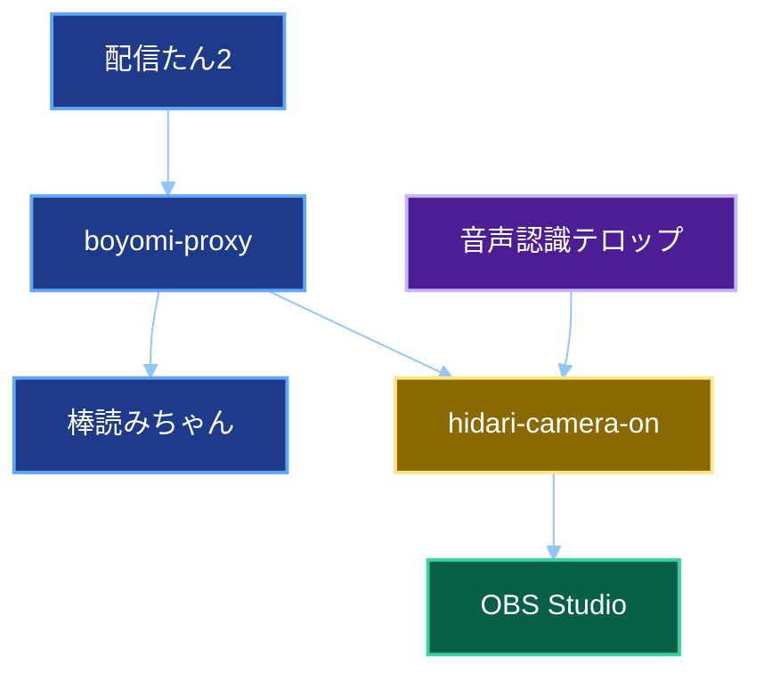

# 左カメラONにするやつ2　改修方針書

## 1. 文書情報

| 項目 | 内容 |
| -- | -- |
| 文書名 | 左カメラONにするやつ2　改修方針書 |
| 対象プロジェクト | boyomi-proxy、speech-recognition-telop、hidari-camera-on |
| 前提文書 | 全体基本設計書、全体詳細設計書 |
| 作成日 | 2026年9月2日 |
| 文書状態 | 初版レビュー依頼版 |

## 2. 目的

本書は、既存のWindows向け左カメラ制御アプリを、新しい車載配信環境へ移行するための改修方針を定める。

対象は次の三つである。

- 既存の`boyomi-proxy`を、棒読みちゃん互換APIとMac側へのコメント中継に特化させる。
- 既存の`speech-recognition-telop`通常版に、確定済み認識文字列の送信機能を追加する。
- macOS上でAPI受付、発動判定、OBS Studio操作、表示時間管理を行う`hidari-camera-on`を新規開発する。

## 3. 改修の基本方針

### 3.1 責務の再配置

現行のboyomi-proxyは、棒読みちゃん中継、発動条件判定、OBS Studioへの仮想キー入力、30秒待機を一つのHTTP要求内で行っている。

改修後は責務を次のように分離する。

| 責務 | 改修後の担当 |
| -- | -- |
| 配信たん2向け棒読みちゃん互換API | boyomi-proxy |
| 棒読みちゃんへの要求中継 | boyomi-proxy |
| コメントのMac側への転送 | boyomi-proxy |
| 音声認識結果のMac側への転送 | speech-recognition-telop |
| コメント発動条件判定 | hidari-camera-on |
| 音声認識発動条件判定 | hidari-camera-on |
| OBS Studio接続および操作 | hidari-camera-on |
| 30秒表示と再発動管理 | hidari-camera-on |
| 異種入力元の重複抑止 | hidari-camera-on |

### 3.2 開発基盤

- C#アプリは.NET 10へ更新する。
- ASP.NET Core Controller方式を使用する。
- C#アプリごとに単一のアプリケーションプロジェクトを作成する。
- ソリューションファイルは使用しない。
- 単体テストはアプリとは別のxUnitプロジェクトとして作成する。
- C#アプリの文化設定は、起動時に日本語へ設定する。
- ログにはSerilogを使用し、31日間保持する。

## 4. 移行後の構成



## 5. boyomi-proxy改修方針

### 5.1 維持する機能

次の外部仕様を維持する。

- `GET /talk`
- `GET /pause`
- `GET /resume`
- `localhost`での待ち受け
- 認証なし
- 棒読みちゃんへのHTTP中継
- 棒読みちゃんのHTTPステータスコードと応答本文の返却
- 応答のコンテンツ種別を`application/json; charset=UTF-8`とする既存動作
- 棒読みちゃん通信失敗時にHTTP 500と空本文を返す既存動作
- 既存の名前空間`SyasaiHidariCamera`

### 5.2 削除する機能

次のWindows固有処理を削除する。

- コメント本文の発動条件判定
- OBS Studioプロセスの検索
- OBS Studioウィンドウへのフォーカス移動
- 仮想キー入力
- `Control`キーと数字テンキーの送出
- `/talk`要求内で行う30秒待機
- 30秒後の復帰キー送出

これに伴い、次の既存クラスまたは依存関係を削除する。

- `HotKeySendService`
- `WindowsNativeMethods`
- `InputSimulatorEx`
- `System.Runtime.InteropServices`を用いたWindows API呼び出し

### 5.3 変更する機能

#### BoyomiProxyController

- 棒読みちゃんへの中継は維持する。
- コメント本文の内容を判定しない。
- `text`の有無や内容にかかわらず、全ての`/talk`要求をMac側送信キューへ投入する。
- 棒読みちゃんへの送信とMac側送信キューへの投入を独立させる。
- 配信たん2へは棒読みちゃんの応答だけを返す。
- Mac側送信の成否を配信たん2向け応答へ反映しない。
- `text`は安全にURL符号化して棒読みちゃんへ転送する。

#### PauseおよびResumeコントローラー

- 既存処理を維持する。
- Mac側へは転送しない。
- HTTPクライアントの再利用方式だけを共通化する。

#### 設定処理

独自の`settings/general-setting.json`および手動シングルトン方式を廃止し、`appsettings.json`と型付き設定へ移行する。

主な設定項目は次のとおりとする。

- API待受ホストおよびポート
- 棒読みちゃんのホストおよびポート
- 棒読みちゃん通信タイムアウト
- Mac側コメントAPIのURL
- Mac側接続タイムアウト
- Mac側要求タイムアウト
- 送信キュー容量
- トークンファイルパス
- レート制限
- ログ保持期間

### 5.4 新規追加する機能

#### Mac側送信キュー

- 容量360件のメモリー内キューを追加する。
- 処理順序は先入れ先出しとする。
- キュー満杯時は新規要求を破棄する。
- 破棄時はWarningログを記録する。
- 永続化は行わない。

#### Mac側送信バックグラウンドサービス

- 常駐処理数は一つとする。
- Mac側APIへBearerトークン付きHTTP POSTを行う。
- 接続タイムアウトは2秒、要求全体のタイムアウトは5秒とする。
- 再試行しない。
- 送信結果をログへ記録する。

#### 共通要求モデル

次の情報をMac側へ送る。

- 要求識別子
- 送信元
- イベント種別
- コメント本文
- Windows側受信日時
- セッション識別子のnull値

### 5.5 内部構造の改善

#### HTTPクライアント

現行の`HttpRequestService`はインスタンス生成ごとに`HttpClient`を生成しているため、`IHttpClientFactory`を使用する方式へ変更する。

- 棒読みちゃん用クライアント
- Mac側API用クライアント

用途ごとに設定を分離し、接続の再利用とタイムアウト管理を行う。

#### ログ

現行のシングルトンロガーが持つ可変`RequestId`は、並列要求で混在する可能性があるため廃止する。

- Serilogの構造化ログを使用する。
- 要求識別子は`LogContext`または要求スコープへ格納する。
- コメント本文はInformationで記録する。
- トークン本文は記録しない。

#### レート制限

現行の1ミリ秒当たり1件から、次へ変更する。

- 固定ウィンドウ方式
- 1秒当たり20要求
- キュー360件
- 先入れ先出し
- 超過時はHTTP 429

### 5.6 既存ファイルの取り扱い

| 既存ファイル | 方針 |
| -- | -- |
| `Controllers/BoyomiProxyController.cs` | 大幅改修 |
| `Controllers/BoyomiProxyPauseController.cs` | 小規模改修 |
| `Controllers/BoyomiProxyResumeController.cs` | 小規模改修 |
| `Services/HttpRequestService.cs` | 廃止し、用途別クライアントへ置換 |
| `Services/HotKeySendService.cs` | 削除 |
| `Services/WindowsNativeMethods.cs` | 削除 |
| `Common/HLogger.cs` | 廃止またはSerilogラッパーなしの構造化ログへ置換 |
| `Common/IHLogger.cs` | 廃止 |
| `Common/LoggerUtil.cs` | `Program.cs`のSerilog構成へ移行 |
| `Model/Setting/Setting.cs` | 廃止 |
| `Model/Setting/GeneralSetting.cs` | 型付き設定クラスへ置換 |
| `settings/general-setting.json` | `appsettings.json`へ統合 |
| `Program.cs` | .NET 10、DI、キュー、レート制限、Serilog構成へ改修 |
| `boyomi-proxy.csproj` | .NET 10および依存パッケージへ更新 |

## 6. speech-recognition-telop改修方針

### 6.1 改修対象

通常版だけを対象とする。

- `client/web-speech/recognition.html`
- `client/web-speech/recognition-script.ts`
- `client/web-speech/recognition-script.js`

翻訳版、音声合成版、ChatGPT版は対象外とする。

### 6.2 維持する機能

- Web Speech APIによる音声認識
- 認識途中文字列の表示
- 確定済み文字列の表示
- 信頼度0.40以上を有効な確定結果とする既存判定
- 音声認識サービス切断時の自動再起動
- 簡易保存機能
- 認識開始、認識終了、保存の既存画面

### 6.3 追加する機能

確定済み音声認識文字列をMac側APIへ送信する。

送信条件は次の両方とする。

- `SpeechRecognitionResult.isFinal`が真
- 信頼度が0.40以上

`onend`時に未確定文字列を簡易保存する既存経路からは送信しない。

### 6.4 送信方式

- 送信先は`http://127.0.0.1:15082/api/v1/speech-recognition`とする。
- Bearerトークンを付加する。
- URLとトークンはソースコードへハードコードする。
- 認識確定ごとに`fetch`を直ちに開始する。
- 複数要求の応答を待たず並行送信する。
- 自動再試行しない。
- 送信失敗はブラウザーコンソールへ記録する。
- 送信失敗によって表示、簡易保存、音声認識継続を停止しない。

### 6.5 セッション識別子

- 認識開始ボタン押下時にUniversally Unique Identifierを生成する。
- 音声認識サービスの自動再起動では同じ値を維持する。
- 認識終了後の再開始時に新しく生成する。
- 生成できない場合は空文字列とする。

### 6.6 並行送信の制約

複数の`fetch`を並行実行するため、Mac側への到着順序が認識確定順と異なる可能性がある。

- Mac側は到着順を前後関係として扱う。
- `receivedAt`による並べ替えは行わない。
- 順序逆転による分割キーワード判定失敗は許容する。

### 6.7 ブラウザー対応

- Google Chromeを正式対応とする。
- Safariは正式対応を目標とし、実機試験する。
- Firefoxは送信機能を対応対象とするが、音声認識機能自体を動作保証しない。
- HTTPSページからHTTPループバックへ送る処理は、各対象ブラウザーで実機試験する。

## 7. hidari-camera-on新規開発方針

### 7.1 アプリケーション概要

macOS上で動作する.NET 10のASP.NET Coreコンソールアプリとして新規開発する。

- 実行環境はmacOS 26 Apple Siliconとする。
- ターミナルから手動起動する。
- Graphical User Interfaceは作成しない。
- `0.0.0.0:15082`で待ち受ける。
- 起動時に文化設定を日本語へ設定する。

### 7.2 提供API

- `POST /api/v1/comments`
- `POST /api/v1/speech-recognition`
- `GET /health`
- Cross-Origin Resource Sharing用`OPTIONS`

コメントAPIと音声認識APIは共通要求形式を使用するが、発動判定方法と認証トークンを分ける。

### 7.3 セキュリティ

#### 接続元制限

次だけを許可する。

- `10.0.0.0/8`
- `172.16.0.0/12`
- `192.168.0.0/16`
- `127.0.0.0/8`
- `::1`

実際の接続元IPアドレスを使用し、転送ヘッダーは信用しない。

#### 固定トークン

- コメント用と音声認識用で別トークンを使用する。
- `Authorization: Bearer`ヘッダーで受信する。
- 固定時間比較を行う。
- コメント用トークン、音声認識用トークン、OBS Studioパスワードは`token/`内の別ファイルから読み込む。

#### Cross-Origin Resource Sharing

- 許可オリジンは`https://skasapp.github.io`とする。
- `POST`と`OPTIONS`を許可する。
- `Authorization`と`Content-Type`を許可する。
- プリフライトキャッシュは1時間とする。

### 7.4 発動判定

#### コメント

- Unicode正規化Form KCを適用する。
- 英字を大文字化する。
- `ひだり`を`左`へ変換する。
- `オン`を`ON`へ変換する。
- 正規化後の`左カメラON`と完全一致した場合に発動する。
- 空白、句読点、助詞は削除しない。

#### 音声認識

- Unicode正規化Form KCを適用する。
- 英字を大文字化する。
- `ひだり`を`左`へ変換する。
- `オン`を`ON`へ変換する。
- 空白および指定された句読点を削除する。
- 今回文字列に`左カメラON`または`左カメラ音`が含まれる場合に発動する。
- 同一セッションの前回末尾と今回先頭を結合し、`左カメラON`が完成する場合に発動する。
- `左カメラ音`は単独の誤認識候補とし、分割結合には使用しない。

### 7.5 セッション管理

- `sessionId`ごとに直前の音声認識文字列一件を保持する。
- nullまたは未指定の`sessionId`は空文字列として扱う。
- 最大10セッションを保持する。
- 最終受信から30分で削除する。
- 永続化しない。

### 7.6 OBS Studio連携

外部ライブラリーを使用せず、OBS WebSocket Version 5の公式プロトコルに従って直接実装する。

必要な処理は次のとおりとする。

- `ClientWebSocket`による接続
- JSONテキストフレーム
- `Hello`受信
- SHA-256による認証文字列生成
- `Identify`送信
- `Identified`受信
- シーンアイテム識別子取得
- シーンアイテム表示状態取得
- シーンアイテム有効化および無効化
- 表示状態変更イベント購読
- 切断検出
- 15秒間隔の無期限再接続

対象は、設定されたシーン内のグループ名によって識別する。

### 7.7 表示時間管理

- OBS Studioの有効化成功から30秒間表示する。
- 同じ入力元から再発動した場合は有効化を再要求し、30秒延長する。
- 異なる入力元から30秒以内に発動した場合は重複として扱い、延長しない。
- 古いタイマーによる誤非表示を防ぐため、取消可能なタイマーと世代管理を行う。
- 無効化失敗時は1秒間隔で3回再試行する。

### 7.8 OBS Studio手動操作

- アプリ管理中に手動で非表示にされた場合、現在のタイマーを終了する。
- 手動非表示後も、次の発動条件では再表示する。
- アプリ待機中に手動表示された場合、アプリ管理外として維持する。
- アプリ管理外の手動表示には30秒タイマーを設定しない。

### 7.9 接続状態管理

次の状態を内部で管理する。

- 未接続
- 接続中
- 認証中
- 接続済み準備未完了
- 操作可能
- 終了中

OBS Studioへ接続できても対象シーンまたはグループが見つからない場合は、接続済み準備未完了として扱う。

- APIの発動要求にはHTTP 503を返す。
- WebSocket接続は維持する。
- 15秒ごとに対象を再探索する。

### 7.10 起動時と終了時

#### 起動時

1. 文化設定を日本語へ設定する。
2. 設定ファイルを読み込む。
3. トークンとOBS Studioパスワードを読み込む。
4. Serilogを初期化する。
5. OBS Studio再接続処理を開始する。
6. API待ち受けを開始する。
7. OBS Studio接続後に対象グループを無効化する。

#### 終了時

1. 新規API受付を停止する。
2. 表示タイマーを停止する。
3. OBS Studio接続中なら対象グループを無効化する。
4. WebSocketを正常終了する。
5. ログをフラッシュする。
6. 最大5秒で終了する。

## 8. 共通ログ方針

### 8.1 保存

- 日次ローリングとする。
- 31日間保持する。
- コンソールとファイルへ出力する。
- ファイル名にはアプリ名を含める。

```text
boyomi-proxy/log/boyomi-proxy-.log
hidari-camera-on/log/hidari-camera-on-.log
```

### 8.2 記録対象

- 実行識別子
- 要求識別子
- API受信日時
- 発信元
- 接続元IPアドレス
- コメントまたは音声認識本文
- 正規化後文字列
- 発動判定結果
- 重複判定結果
- OBS Studio接続結果
- OBS Studio操作結果
- 外部HTTP通信結果
- 例外情報

### 8.3 記録禁止情報

- Authorizationヘッダー
- 固定トークン本文
- OBS Studioパスワード

## 9. 設定および秘密情報の移行方針

### 9.1 boyomi-proxy

既存の`settings/general-setting.json`から`appsettings.json`へ移行する。

移行対象は次のとおりとする。

- 待受ポート
- 棒読みちゃんホスト
- 棒読みちゃんポート

新規追加する設定は次のとおりとする。

- Mac側API URL
- Mac側通信タイムアウト
- 送信キュー容量
- レート制限
- ログ保持期間
- トークンファイルパス

### 9.2 hidari-camera-on

通常設定は`appsettings.json`へ保存する。

秘密情報は`token/`へ保存する。

```text
token/comment-api-token.txt
token/speech-api-token.txt
token/obs-websocket-password.txt
```

リポジトリーには`.example`ファイルだけを登録し、実ファイルは`.gitignore`で除外する。

### 9.3 speech-recognition-telop

Mac側API URLと音声認識用トークンはTypeScriptソースへ直接記載する。公開リポジトリーから閲覧可能であることを許容する。

## 10. 依存関係変更

### 10.1 boyomi-proxyから削除

- `InputSimulatorEx`
- Windows仮想キー操作にだけ必要な依存関係

### 10.2 boyomi-proxyへ追加または更新

- .NET 10対応のSerilog関連パッケージ
- `Serilog.AspNetCore`
- xUnit関連パッケージはテストプロジェクトへ追加

### 10.3 hidari-camera-onへ追加

- ASP.NET Core共有フレームワーク
- Serilog関連パッケージ
- xUnit関連パッケージはテストプロジェクトへ追加

OBS Studioクライアントライブラリーは追加しない。

## 11. 実装順序

### 第1段階　基盤整備

1. boyomi-proxyを.NET 10へ更新する。
2. boyomi-proxyの設定を`appsettings.json`へ移行する。
3. Serilog構成と要求識別子管理を更新する。
4. `IHttpClientFactory`へ移行する。
5. xUnitテストプロジェクトを作成する。

### 第2段階　Windows固有OBS処理の除去

1. 発動条件判定を削除する。
2. 30秒待機を削除する。
3. 仮想キー処理を削除する。
4. `InputSimulatorEx`を削除する。
5. `/talk`、`/pause`、`/resume`の回帰試験を行う。

### 第3段階　Mac側コメント中継

1. 共通要求モデルを追加する。
2. トークン読み込みを追加する。
3. 容量制限付き送信キューを追加する。
4. バックグラウンド送信サービスを追加する。
5. Mac側停止中でも棒読みちゃん経路が維持されることを確認する。

### 第4段階　hidari-camera-on API

1. .NET 10プロジェクトを作成する。
2. 日本語文化設定、Serilog、型付き設定を実装する。
3. 接続元IPアドレス制限を実装する。
4. Bearerトークン認証を実装する。
5. コメントAPI、音声認識API、ヘルスチェックを実装する。
6. レート制限とCross-Origin Resource Sharingを実装する。

### 第5段階　発動判定

1. Unicode正規化処理を実装する。
2. コメント完全一致判定を実装する。
3. 音声認識部分一致判定を実装する。
4. 前回末尾と今回先頭の結合判定を実装する。
5. セッションストアを実装する。
6. 発動条件の単体テストを作成する。

### 第6段階　OBS Studio連携

1. OBS WebSocketメッセージモデルを作成する。
2. 認証文字列生成を実装する。
3. 接続と識別処理を実装する。
4. 要求応答対応付けを実装する。
5. シーンアイテム識別子取得を実装する。
6. 表示状態取得と変更を実装する。
7. イベント受信を実装する。
8. 15秒間隔の再接続を実装する。

### 第7段階　表示時間と重複管理

1. 30秒タイマーを実装する。
2. タイマー世代管理を実装する。
3. 同一入力元の延長を実装する。
4. 異なる入力元の重複抑止を実装する。
5. 手動表示および非表示の追跡を実装する。
6. 無効化再試行を実装する。

### 第8段階　音声認識テロップ連携

1. 通常版TypeScriptへ送信処理を追加する。
2. セッション識別子管理を追加する。
3. JavaScriptを生成する。
4. Google Chromeで試験する。
5. Safariで試験する。
6. Firefoxで送信部分を試験する。

### 第9段階　総合試験と配布

1. Windows仮想マシンとMac間の疎通試験を行う。
2. 配信たん2、棒読みちゃん、OBS Studioを含む結合試験を行う。
3. 再接続、異常終了、キュー超過を試験する。
4. `win-arm64`版を発行する。
5. `osx-arm64`版を発行する。
6. 設定例とトークン例を整備する。

## 12. テスト方針

### 12.1 回帰試験

boyomi-proxyでは次を最優先とする。

- 配信たん2から既存どおり利用できること。
- 読み上げが既存どおり動作すること。
- 一時停止と再開が既存どおり動作すること。
- 棒読みちゃん応答が既存どおり返ること。
- Mac側停止中でも既存機能が利用できること。

### 12.2 単体試験

- URL符号化
- キュー満杯処理
- IPアドレス範囲判定
- トークン認証
- コメント表記揺れ
- 音声認識表記揺れ
- 分割文字列結合
- 同一入力元の30秒延長
- 異種入力元の重複抑止
- OBS WebSocket認証文字列
- OBS WebSocket要求応答対応付け
- タイマー世代管理

### 12.3 実機試験

- macOS 26 Apple Silicon
- Windows 11 Arm仮想マシン
- OBS Studio
- 配信たん2
- 棒読みちゃん
- Google Chrome
- Safari
- Firefox

## 13. リリースおよび切替方針

### 13.1 事前準備

1. OBS Studioに左カメラ、枠、テキストをまとめたグループを作成する。
2. 対象シーン名とグループ名を確定する。
3. OBS WebSocketを有効化する。
4. OBS WebSocketパスワードを設定する。
5. コメント用と音声認識用の固定トークンを作成する。
6. Windows側からMac側の`10.37.129.2:15082`へ接続できることを確認する。

### 13.2 段階切替

1. hidari-camera-onをMac上で起動し、手動HTTP要求でOBS Studio操作を確認する。
2. boyomi-proxyのMac側転送を有効化し、コメント経由を確認する。
3. 音声認識テロップの送信機能を有効化し、音声経由を確認する。
4. 異種入力元重複と再発動延長を確認する。
5. 車載配信の実運用へ切り替える。

### 13.3 切戻し

問題発生時は、次の順で切り戻す。

- 音声認識テロップは改修前の`recognition-script.js`へ戻す。
- boyomi-proxyはMac側送信を無効化できる設定を設けず、必要な場合は改修前バイナリーへ戻す。
- hidari-camera-onを停止する。
- 旧来のWindows側OBS Studio制御へ戻す場合は、旧Windows環境でのみ旧バイナリーを使用する。

新しいMac環境では旧仮想キー方式を利用できないため、hidari-camera-on停止中は左カメラ自動表示機能が利用できないことを許容する。

## 14. リスクと対策

| リスク | 影響 | 対策 |
| -- | -- | -- |
| HTTPSページからHTTPループバックAPIへ接続できない | 音声認識連携不能 | 対象ブラウザーで事前実機試験し、必要なら将来HTTPS化を検討する |
| 音声認識要求の到着順序が逆転する | 分割発動を見逃す | 制約として許容し、ログから確認可能にする |
| OBS WebSocket仕様変更 | OBS操作不能 | 直接実装範囲を分離し、公式プロトコルとの差分を追跡する |
| OBS Studio未起動または切断 | 発動不能 | 15秒間隔で無期限に再接続する |
| 対象グループ名変更 | 発動不能 | 設定ファイル化し、15秒ごとに再探索する |
| Mac側送信キュー超過 | コメント通知欠落 | 360件へ制限し、破棄をWarningログへ記録する |
| 公開トークンの悪用 | ローカルAPIへの不正要求 | 接続元IPアドレス制限と発信元別トークンを併用する |
| HTTPの平文通信 | トークンや本文の観測 | 仮想ネットワーク内利用に限定する |
| 手動操作と自動操作の競合 | 意図しない再表示または非表示 | OBSイベントを追跡し、手動非表示を優先する |
| アプリ異常終了 | 左カメラが表示されたまま残る | 次回接続時に対象グループを無効化する |

## 15. 完了条件

次を全て満たした時点で改修完了とする。

- boyomi-proxyが.NET 10で`win-arm64`向けに発行できる。
- hidari-camera-onが.NET 10で`osx-arm64`向けに発行できる。
- 配信たん2から読み上げ、一時停止、再開を既存どおり利用できる。
- 全ての`/talk`要求がMac側へ転送される。
- コメントの定義済み表記だけが完全一致で発動する。
- 音声認識の定義済み表記と分割文字列が発動する。
- OBS Studioの対象グループが30秒間表示される。
- 同一入力元再発動で30秒が延長される。
- 異なる入力元の30秒以内発動で延長されない。
- OBS Studio切断後に15秒間隔で再接続する。
- 手動で非表示にした後、次の発動条件で再表示される。
- ログが日次出力され31日間保持される。
- Google Chromeで音声認識連携が動作する。
- Safariの動作可否とFirefoxの対応範囲が試験結果として記録される。
- 単体試験と結合試験の重大な未解決不具合がない。
