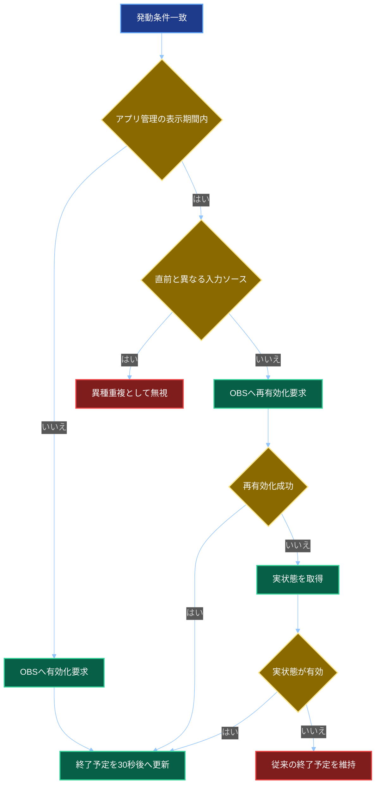

# 左カメラONにするやつ2　全体詳細設計書

## 1. 文書情報

| 項目 | 内容 |
| -- | -- |
| 文書名 | 左カメラONにするやつ2　全体詳細設計書 |
| 対象 | boyomi-proxy、speech-recognition-telop、hidari-camera-on |
| 基本設計 | 承認済み。ログ保持期間は31日へ修正済みとして扱う |
| 作成日 | 2026年9月2日 |
| 文書状態 | 初版レビュー依頼版 |

## 2. 設計方針

- C#アプリは.NET 10およびASP.NET Core Controller方式で実装する。
- Windows側とMac側は別リポジトリーまたは別ルートの単一アプリケーションプロジェクトとする。
- ソリューションファイルは作成しない。
- 単体テストはアプリケーションとは別のxUnitプロジェクトとする。
- boyomi-proxyの既存名前空間`SyasaiHidariCamera`は変更しない。
- hidari-camera-onも既存資産との統一を優先し、ルート名前空間を`SyasaiHidariCamera`とする。
- OBS WebSocket Version 5は外部クライアントライブラリーを使用せず、公式プロトコルに従って必要部分だけ直接実装する。
- TypeScriptを音声認識テロップの正とし、JavaScriptはコンパイル成果物として同期する。

## 3. プロジェクト構成

### 3.1 boyomi-proxy

```text
boyomi-proxy/
├─ boyomi-proxy.csproj
├─ Program.cs
├─ appsettings.json
├─ Controllers/
│  ├─ BoyomiProxyController.cs
│  ├─ BoyomiProxyPauseController.cs
│  └─ BoyomiProxyResumeController.cs
├─ Models/
│  ├─ Api/
│  │  └─ CameraEventRequest.cs
│  └─ Settings/
│     ├─ BoyomiProxySettings.cs
│     └─ HidariCameraApiSettings.cs
├─ Services/
│  ├─ BoyomiClient.cs
│  ├─ HidariCameraQueue.cs
│  ├─ HidariCameraSenderService.cs
│  ├─ RequestFactory.cs
│  └─ TokenFileService.cs
├─ Common/
│  └─ LoggingExtensions.cs
├─ token/
│  └─ comment-api-token.txt.example
└─ log/
```

```text
boyomi-proxy.Tests/
├─ boyomi-proxy.Tests.csproj
├─ Controllers/
├─ Services/
└─ Models/
```

### 3.2 hidari-camera-on

```text
hidari-camera-on/
├─ hidari-camera-on.csproj
├─ Program.cs
├─ appsettings.json
├─ Controllers/
│  ├─ CommentsController.cs
│  ├─ SpeechRecognitionController.cs
│  └─ HealthController.cs
├─ Models/
│  ├─ Api/
│  │  ├─ CameraEventRequest.cs
│  │  ├─ CameraEventResponse.cs
│  │  └─ HealthResponse.cs
│  ├─ Domain/
│  │  ├─ CameraTriggerSource.cs
│  │  ├─ CameraOperationResult.cs
│  │  └─ ObsConnectionState.cs
│  └─ Settings/
│     ├─ ApiSettings.cs
│     ├─ SecuritySettings.cs
│     ├─ CameraSettings.cs
│     └─ ObsWebSocketSettings.cs
├─ Middleware/
│  ├─ PrivateNetworkRestrictionMiddleware.cs
│  └─ BearerTokenAuthenticationMiddleware.cs
├─ Services/
│  ├─ CameraTriggerService.cs
│  ├─ CommentTriggerMatcher.cs
│  ├─ SpeechTriggerMatcher.cs
│  ├─ TextNormalizationService.cs
│  ├─ SpeechSessionStore.cs
│  ├─ CameraDisplayCoordinator.cs
│  ├─ ObsWebSocketClient.cs
│  ├─ ObsConnectionWorker.cs
│  ├─ TokenFileService.cs
│  └─ ApplicationVersionService.cs
├─ ObsProtocol/
│  ├─ ObsOpCode.cs
│  ├─ ObsMessageEnvelope.cs
│  ├─ ObsHelloMessage.cs
│  ├─ ObsIdentifyMessage.cs
│  ├─ ObsRequestMessage.cs
│  ├─ ObsRequestResponseMessage.cs
│  ├─ ObsEventMessage.cs
│  └─ ObsAuthenticationService.cs
├─ Common/
│  └─ LoggingExtensions.cs
├─ token/
│  ├─ comment-api-token.txt.example
│  ├─ speech-api-token.txt.example
│  └─ obs-websocket-password.txt.example
└─ log/
```

```text
hidari-camera-on.Tests/
├─ hidari-camera-on.Tests.csproj
├─ Controllers/
├─ Middleware/
├─ Services/
└─ ObsProtocol/
```

### 3.3 speech-recognition-telop

既存構成を維持し、通常版に関係する次のファイルだけを主対象とする。

```text
client/web-speech/
├─ recognition.html
├─ recognition-script.ts
├─ recognition-script.js
└─ tsconfig.json
```

## 4. NuGetパッケージ

### 4.1 共通

- `Serilog`
- `Serilog.AspNetCore`
- `Serilog.Sinks.Console`
- `Serilog.Sinks.File`

### 4.2 テスト

- `Microsoft.NET.Test.Sdk`
- `xunit`
- `xunit.runner.visualstudio`
- `coverlet.collector`
- 必要に応じて`Microsoft.AspNetCore.Mvc.Testing`

OBS Studio連携用の外部NuGetパッケージは使用しない。

## 5. 共通APIモデル

### 5.1 CameraEventRequest

```json
{
	"requestId": "xxxxxxxx-xxxx-xxxx-xxxx-xxxxxxxxxxxx",
	"source": "boyomi-proxy",
	"eventType": "talk",
	"text": "左カメラON",
	"receivedAt": "2026-09-02T12:00:00.123+09:00",
	"sessionId": null
}
```

| プロパティ | JSON型 | 必須 | 制約 |
| -- | -- | -- | -- |
| `requestId` | string | 必須 | UUID、36文字以内 |
| `source` | string | 必須 | エンドポイント固有値、64文字以内 |
| `eventType` | string | 必須 | 64文字以内。内容は検証しない |
| `text` | string | 必須 | 4,096文字以内。空文字列を許可 |
| `receivedAt` | string | 必須 | ISO 8601、タイムゾーン必須 |
| `sessionId` | stringまたはnull | 条件付き | 音声認識では空文字列を含め許可。36文字以内 |

要求本文全体は64 KiB以下とする。形式不正は`400 Bad Request`、本文超過は`413 Content Too Large`とする。

### 5.2 CameraEventResponse

```json
{
	"requestId": "xxxxxxxx-xxxx-xxxx-xxxx-xxxxxxxxxxxx",
	"accepted": true,
	"triggered": true,
	"duplicate": false,
	"obsOperation": "enabled",
	"message": "左カメラを有効化しました。"
}
```

`obsOperation`は次のいずれかとする。

- `notRequired`
- `enabled`
- `duplicateIgnored`
- `failed`

エラー応答はASP.NET Coreの`ProblemDetails`を用いる。

## 6. boyomi-proxy詳細設計

### 6.1 公開API

#### GET /talk

1. `text`を取得し、nullの場合は空文字列へ変換する。
2. 要求識別子を生成する。
3. コメント本文をInformationログへ記録する。
4. 棒読みちゃんへの要求を開始する。
5. CameraEventRequestを生成して容量制限付きキューへ投入する。
6. キュー投入結果にかかわらず棒読みちゃんの完了を待つ。
7. 棒読みちゃんのHTTPステータスコードと本文を返す。
8. コンテンツ種別は既存互換のため`application/json; charset=UTF-8`固定とする。

棒読みちゃんへのURLは文字列連結せず、クエリー値を正しくURL符号化する。

#### GET /pauseおよびGET /resume

- 既存どおり棒読みちゃんだけへ中継する。
- Mac側には送信しない。
- 応答仕様は`/talk`と同じ既存互換方針とする。

### 6.2 棒読みちゃんクライアント

- `HttpClientFactory`で名前付きクライアントを登録する。
- 既定ホストは`localhost`、既定ポートは既存設定値を引き継ぐ。
- HTTP Version 2を要求し、下位版へのフォールバックを許可する。
- 自動展開はGzipおよびBrotliを許可する。
- タイムアウトは既存どおり60秒とする。
- 通信例外時はHTTP 500、空本文としてコントローラーへ返す。

### 6.3 Mac側送信キュー

- `Channel<CameraEventRequest>`を使用する。
- 容量は360件とする。
- 先入れ先出しとする。
- キュー満杯時は新しい要求を破棄し、Warningログへ記録する。
- 常駐コンシューマー数は1とする。
- 永続化しない。
- 正常終了時は最大5秒間だけ残存処理を待つ。

### 6.4 Mac側送信サービス

- キューから要求を一件ずつ取得する。
- `Authorization: Bearer <token>`を付加する。
- `Content-Type`は`application/json; charset=utf-8`とする。
- 接続タイムアウト2秒、要求全体タイムアウト5秒とする。
- 自動再試行は行わない。
- 成否および応答本文をログへ記録する。
- 配信たん2へのHTTP要求スコープから独立させる。

### 6.5 レート制限

- 固定ウィンドウ方式を使用する。
- 上限は1秒当たり20要求とする。
- キュー容量は360件とする。
- 処理順は先入れ先出しとする。
- 超過時は`429 Too Many Requests`とする。
- `/talk`、`/pause`、`/resume`へ同じポリシーを適用する。

## 7. speech-recognition-telop詳細設計

### 7.1 送信条件

`recognition.onresult`内で次のすべてを満たした場合に送信する。

- 最新の`SpeechRecognitionResult.isFinal`が真
- 最新候補の`confidence`が0.40以上
- 通常版画面で認識処理中

`onend`内の`simplyRecord`経路からは送信しない。

### 7.2 ハードコード設定

```text
API URL
http://127.0.0.1:15082/api/v1/speech-recognition

許可オリジン
https://skasapp.github.io

固定トークン
ソースコード内定数
```

### 7.3 セッション識別子

- 認識開始ボタン押下時に`crypto.randomUUID()`で生成する。
- ブラウザー内部の自動再起動では維持する。
- 認識終了ボタン押下時に空文字列へ戻す。
- 再度開始した場合は新規生成する。
- `crypto.randomUUID()`が利用できない場合は空文字列を使用する。

### 7.4 要求送信

- 各確定結果で`fetch`を直ちに開始する。
- 複数の`fetch`を並行実行する。
- 前の応答を待たず、次の認識結果を送信する。
- 到着順序が入れ替わり、分割結合判定に失敗する場合は許容する。
- 自動再送しない。
- 失敗はブラウザーコンソールへ記録する。
- 認識、表示、簡易保存は送信完了を待たない。

## 8. hidari-camera-on API詳細設計

### 8.1 待受

- `http://0.0.0.0:15082`
- Controller方式
- JSONはUTF-8
- ヘルスチェック以外へレート制限を適用する。

### 8.2 ミドルウェア順序

```text
例外処理
要求本文サイズ制限
要求ログ
Cross-Origin Resource Sharing
レート制限
接続元IPアドレス制限
ルーティング
固定トークン認証
Controller
```

### 8.3 接続元IPアドレス制限

次を許可する。

- `10.0.0.0/8`
- `172.16.0.0/12`
- `192.168.0.0/16`
- `127.0.0.0/8`
- `::1`

`HttpContext.Connection.RemoteIpAddress`を使用し、転送ヘッダーは参照しない。IPv4射影IPv6アドレスはIPv4へ正規化して判定する。

### 8.4 固定トークン認証

- コメントAPIはコメント用トークンを使用する。
- 音声認識APIは音声認識用トークンを使用する。
- ヘルスチェックと`OPTIONS`は認証しない。
- Bearerスキーム以外は`401 Unauthorized`とする。
- 比較は固定時間比較で行う。

### 8.5 Cross-Origin Resource Sharing

- 許可オリジンは`https://skasapp.github.io`だけとする。
- 許可メソッドは`POST`と`OPTIONS`とする。
- 許可ヘッダーは`Authorization`と`Content-Type`とする。
- 資格情報付きCookieは許可しない。
- `Access-Control-Max-Age`は3,600秒とする。

### 8.6 コメントAPI

#### POST /api/v1/comments

- `source`が`boyomi-proxy`であることを検証する。
- `eventType`の値は検証しない。
- コメント用正規化と完全一致判定を行う。
- 空文字列は正常な非発動要求として扱う。

### 8.7 音声認識API

#### POST /api/v1/speech-recognition

- `source`が`speech-recognition-telop`であることを検証する。
- `eventType`の値は検証しない。
- `sessionId`がnullまたは未指定の場合も空文字列として扱う。
- 音声認識用正規化、今回文字列判定、前回文字列との分割結合判定を行う。
- 判定後、今回の正規化前文字列と正規化後文字列をセッションストアへ保存する。

### 8.8 ヘルスチェック

#### GET /health

```json
{
	"status": "Healthy",
	"version": "1.0.0"
}
```

- 認証なし
- レート制限なし
- OBS Studio状態を含めない
- HTTP 200を返す

### 8.9 レート制限

- 接続元IPアドレス単位の固定ウィンドウ方式
- 1秒間に20要求
- キューなし
- 超過時は`429 Too Many Requests`
- ヘルスチェックは対象外

## 9. 文字列正規化詳細設計

### 9.1 共通処理

Unicode正規化Form KCを適用する。互換分解後に再合成されるため、全角英数字を揃えつつ、日本語の結合文字を比較しやすい形式で保持できる。

### 9.2 コメント正規化

順序は次のとおりとする。

1. Unicode正規化Form KC
2. 英字の大文字化
3. `ひだり`を`左`へ置換
4. `オン`を`ON`へ置換

空白、句読点、助詞は削除しない。

最終的な許可文字列は`左カメラON`一つに正規化される。

### 9.3 音声認識正規化

順序は次のとおりとする。

1. Unicode正規化Form KC
2. 英字の大文字化
3. `ひだり`を`左`へ置換
4. `オン`を`ON`へ置換
5. 次の文字をすべて削除

```text
半角空白
全角空白
、
。
，
,
．
.
？
?
！
!
・
```

誤認識候補`左カメラ音`は文字列全体の一般置換を行わず、別の発動キーワードとして扱う。

### 9.4 今回文字列判定

正規化後文字列が次のいずれかを含む場合に一致とする。

```text
左カメラON
左カメラ音
```

### 9.5 分割結合判定

- 正規化後の標準キーワード`左カメラON`を基準とする。
- 前回末尾と今回先頭の全分割位置を調べる。
- 前回末尾がキーワード先頭部、今回先頭が残部に一致する場合に発動する。
- `左カメラ音`は単一結果内の誤認識候補であり、分割結合対象にはしない。
- 前回が完成済みキーワードで終わり、今回に新たなキーワードがない場合は発動しない。

## 10. 音声認識セッションストア

- キーは`sessionId`とする。
- nullおよび未指定は空文字列へ変換し、空文字列キーとして扱う。
- セッションごとに直前一件だけを保持する。
- 最終受信から30分経過した情報を削除する。
- 最大10セッションとする。
- 上限超過時は最終受信時刻が最も古いセッションを削除する。
- 永続化しない。
- アプリ再起動時に消失してよい。
- スレッドセーフなコレクションと排他制御を使用する。

並行`fetch`の到着順をそのまま前後関係として扱う。送信元の`receivedAt`による並べ替えは行わない。

## 11. 発動および重複判定

### 11.1 状態

CameraDisplayCoordinatorは次を保持する。

- アプリが管理する表示中フラグ
- 最後に有効化成功した入力ソース
- 有効化成功時刻
- 無効化予定時刻
- タイマー世代番号
- OBS Studioから受信した実表示状態

### 11.2 判定順序



### 11.3 異種ソース重複

- 判定期間は最後のOBS Studio有効化成功時刻から30秒間とする。
- コメントと音声認識の入力元が異なる場合は重複とする。
- OBS Studio操作を行わない。
- 無効化予定時刻を延長しない。
- HTTP 200を返す。

### 11.4 同一ソース再発動

- OBS Studioへ有効化を再要求する。
- 成功時は成功時刻から30秒後へ延長する。
- 失敗時は実表示状態を取得する。
- 実状態が有効なら取得完了時点から30秒後へ延長する。
- 状態取得にも失敗、または無効なら従来の終了予定を維持する。

### 11.5 手動操作

- 表示中に手動で非表示にされた場合、当該タイマーを終了し、直ちには再表示しない。
- その後、新たな発動条件を検出した場合は再表示する。
- 待機中に手動で表示された場合、アプリ管理外としてそのまま維持する。
- アプリ管理外の手動表示には30秒タイマーを設定しない。

## 12. タイマー設計

- 有効化成功時に世代番号を増加させる。
- タイマー開始時に世代番号をキャプチャする。
- 待機後、世代番号が一致する場合だけ無効化する。
- 延長時は新しい世代のタイマーを開始し、旧タイマーを無効化する。
- `PeriodicTimer`で常時監視せず、取消可能な`Task.Delay`を使用する。
- 時刻比較には単調時計を用いる。

### 12.1 無効化再試行

- 終了予定時刻に初回操作を行う。
- 失敗時は1秒間隔で3回再試行する。
- 全失敗時はErrorログを出す。
- OBS Studio未接続の場合は、再接続成功時の初期化で無効化する。

## 13. OBS WebSocket直接実装

### 13.1 採用判断

本機能で必要な要求とイベントは限定されているため、公式OBS WebSocket Version 5プロトコルに従った直接実装を採用する。実装対象を限定し、外部ライブラリーの更新状況に依存しない構成とする。

### 13.2 通信方式

- `ClientWebSocket`を使用する。
- URIは`ws://127.0.0.1:4455`を既定とする。
- サブプロトコルは`obswebsocket.json`とする。
- JSONテキストフレームのみを使用する。
- 単一の受信ループを常時動作させる。
- 送信は`SemaphoreSlim`で直列化する。

### 13.3 接続手順

1. WebSocket接続を確立する。
2. OBS StudioからOpCode 0の`Hello`を受信する。
3. 認証情報がある場合、公式手順で認証文字列を生成する。
4. RPC Version 1と必要なイベント購読値を含むOpCode 1の`Identify`を送る。
5. OpCode 2の`Identified`を受信する。
6. 操作準備処理へ進む。

### 13.4 認証文字列

公式仕様のSHA-256計算を実装する。

```text
secret = Base64 SHA256 password + salt
authentication = Base64 SHA256 secret + challenge
```

文字コードはUTF-8とし、連結後のバイト列へSHA-256を適用する。

### 13.5 使用要求

実装対象を次に限定する。

- `GetVersion`
- `GetSceneItemId`
- `GetSceneItemEnabled`
- `SetSceneItemEnabled`

各要求は一意の`requestId`を持つ。`ConcurrentDictionary`で応答待ちの`TaskCompletionSource`を管理し、OpCode 7の`RequestResponse`到着時に完了させる。

### 13.6 イベント購読

対象シーンアイテムの状態追跡に必要なイベントを購読する。

- シーンアイテム有効状態変更
- シーンアイテム作成
- シーンアイテム削除
- シーン名変更に関連するイベント
- WebSocket切断

対象外のシーンまたはシーンアイテムのイベントは無視する。

### 13.7 グループ識別

1. 設定のシーン名とソース名を使って`GetSceneItemId`を送信する。
2. 取得した数値識別子をメモリーへ保持する。
3. 再接続、対象アイテム削除、再作成を検出した場合は破棄して再取得する。
4. 同名アイテムが複数存在しないことを前提とする。

### 13.8 接続状態

```text
Disconnected
Connecting
Identifying
ConnectedNotReady
Ready
Stopping
```

APIからOBS Studio操作可能なのは`Ready`だけとする。

### 13.9 再接続

- ObsConnectionWorker一つだけが担当する。
- 接続失敗または切断後、15秒待機する。
- アプリ終了まで無期限に再試行する。
- API処理から再接続を直接開始しない。
- 接続後に対象識別子を取得し、対象グループを無効化する。
- 対象が見つからない場合は`ConnectedNotReady`とし、15秒ごとに再取得する。
- 同一エラーのログは抑制し、初回と一定回数ごとに出力する。

## 14. ログ詳細設計

### 14.1 ファイル

```text
boyomi-proxy/log/boyomi-proxy-.log
hidari-camera-on/log/hidari-camera-on-.log
```

- 日次ローリング
- 31日保持
- UTF-8
- コンソールにも同時出力

### 14.2 ログレベル

- Debug：正規化前後、HTTP送信開始、OBS要求と応答、タイマー更新
- Information：API受付、本文、発動、重複抑止、有効化、無効化、接続、切断
- Warning：外部通信失敗、キュー破棄、認証失敗、許可外IPアドレス
- Error：OBS最終操作失敗、無効化失敗、バックグラウンド例外
- Fatal：設定不正、必須トークン読み込み失敗

### 14.3 秘密情報

- Authorizationヘッダーを記録しない。
- OBS Studioパスワードを記録しない。
- トークン本文を記録しない。
- トークンファイルパスは記録可能とする。
- コメント本文と音声認識本文はInformationで記録する。

要求識別子はSerilogの`LogContext`または構造化プロパティとして保持し、共有サービスの可変フィールドには保存しない。

## 15. 設定詳細設計

### 15.1 boyomi-proxy appsettings.json

```json
{
	"Server": {
		"ListenHost": "localhost",
		"ListenPort": 15080
	},
	"Boyomi": {
		"Host": "localhost",
		"Port": 40080,
		"TimeoutSeconds": 60
	},
	"HidariCameraApi": {
		"Url": "http://10.37.129.2:15082/api/v1/comments",
		"ConnectTimeoutSeconds": 2,
		"RequestTimeoutSeconds": 5,
		"QueueCapacity": 360,
		"TokenFile": "token/comment-api-token.txt"
	},
	"RateLimit": {
		"PermitLimit": 20,
		"WindowSeconds": 1,
		"QueueLimit": 360
	},
	"Logging": {
		"RetainedDays": 31
	}
}
```

### 15.2 hidari-camera-on appsettings.json

```json
{
	"Server": {
		"ListenHost": "0.0.0.0",
		"ListenPort": 15082,
		"MaximumRequestBodyBytes": 65536
	},
	"Security": {
		"AllowedNetworks": [
			"10.0.0.0/8",
			"172.16.0.0/12",
			"192.168.0.0/16",
			"127.0.0.0/8",
			"::1/128"
		],
		"AllowedOrigins": [
			"https://skasapp.github.io"
		],
		"CommentTokenFile": "token/comment-api-token.txt",
		"SpeechTokenFile": "token/speech-api-token.txt"
	},
	"Camera": {
		"DisplaySeconds": 30,
		"DisableRetryCount": 3,
		"DisableRetryIntervalMilliseconds": 1000,
		"SpeechSessionExpiryMinutes": 30,
		"MaximumSpeechSessions": 10
	},
	"ObsWebSocket": {
		"Uri": "ws://127.0.0.1:4455",
		"PasswordFile": "token/obs-websocket-password.txt",
		"SceneName": "配信シーン",
		"SourceName": "左カメラワイプ",
		"ReconnectIntervalSeconds": 15,
		"RequestTimeoutSeconds": 5
	},
	"RateLimit": {
		"PermitLimit": 20,
		"WindowSeconds": 1,
		"QueueLimit": 0
	},
	"Logging": {
		"RetainedDays": 31
	}
}
```

## 16. 起動処理

### 16.1 boyomi-proxy

1. 文化設定を日本語へ設定する。
2. appsettings.jsonを読み込む。
3. 型付き設定を検証する。
4. トークンファイルを読み込む。
5. Serilogを初期化する。
6. HTTPクライアント、キュー、常駐サービスを登録する。
7. localhostでAPI待受を開始する。

Mac側トークンが読めない場合は、全コメントをMac側へ送る必須要件を満たせないためFatal終了する。

### 16.2 hidari-camera-on

1. 文化設定を日本語へ設定する。
2. appsettings.jsonを読み込む。
3. 型付き設定を検証する。
4. 二つのAPIトークンとOBS Studioパスワードを読み込む。
5. Serilogを初期化する。
6. OBS WebSocket再接続ワーカーを開始する。
7. `0.0.0.0:15082`でAPI待受を開始する。
8. OBS Studio接続成功後に対象グループを無効化する。

## 17. 終了処理

`Control+C`、SIGTERM、ターミナル終了、システム終了通知を対象とする。

### 17.1 boyomi-proxy

1. 新規要求受付を停止する。
2. キューへの書き込みを完了する。
3. 最大5秒間、残存送信を待つ。
4. Serilogをフラッシュする。
5. 終了する。

### 17.2 hidari-camera-on

1. 新規要求受付を停止する。
2. タイマーを取り消す。
3. OBS Studio接続中なら対象グループを無効化する。
4. WebSocketを正常終了する。
5. Serilogをフラッシュする。
6. 最大5秒で終了する。

## 18. 単体テスト設計

### 18.1 boyomi-proxy

- nullの`text`を空文字列へ変換する。
- 特殊文字を含む本文を正しくURL符号化する。
- `/talk`がMac側キューへ全件投入する。
- `/pause`と`/resume`がMac側へ送信しない。
- Mac側送信失敗が棒読みちゃん応答に影響しない。
- キュー満杯時に新規要求を破棄する。
- 棒読みちゃんのステータスコードと本文を維持する。

### 18.2 hidari-camera-on

- 各プライベートIPアドレス範囲とループバックを許可する。
- パブリックIPアドレスを拒否する。
- Bearerトークンを固定時間比較する。
- コメントの全許可表記と不許可表記を判定する。
- 音声認識の句読点、空白、全角英字を正規化する。
- 全分割位置で前回末尾と今回先頭を結合する。
- 完成済み前回キーワードだけでは再発動しない。
- `左カメラ音`を単体の誤認識候補として発動する。
- nullの`sessionId`を空文字列として扱う。
- 異種ソース重複が延長しない。
- 同一ソース再発動が30秒延長する。
- 古いタイマーが新しい表示を無効化しない。
- 手動非表示後の次回発動で再表示する。
- 無効化を1秒間隔で3回再試行する。
- OBS要求と応答を`requestId`で対応付ける。
- OBS認証文字列を公式例と一致させる。

### 18.3 speech-recognition-telop

既存にテスト基盤がないため、少なくとも手動試験とブラウザー開発者ツールで次を確認する。

- 確定かつ信頼度0.40以上だけを送る。
- `onend`の未確定文字列を送らない。
- 複数要求を並行送信する。
- 新しい認識開始ごとにセッション識別子を更新する。
- 自動再起動時にセッション識別子を維持する。
- 送信失敗時も認識と画面表示を継続する。

## 19. 結合試験観点

- 配信たん2から`/talk`を呼び、棒読みちゃんの応答が変わらないこと。
- Mac側停止中でも棒読みちゃん経路が動作すること。
- 棒読みちゃん停止中でもMac側へコメントが送信されること。
- コメント完全一致で30秒表示されること。
- 音声認識の単一結果および分割結果で表示されること。
- コメントと音声認識の異種重複で延長されないこと。
- 同一ソース再発動で延長されること。
- OBS Studio切断後、15秒間隔で再接続すること。
- 対象グループがない場合、接続済み使用不可として再探索すること。
- Google Chrome、Safari、FirefoxでHTTP送信部分を確認すること。
- HTTPSページからHTTPループバックへの送信可否を各ブラウザーで確認すること。
- ログが日次更新され31日後に削除されること。

## 20. ビルドおよび発行

### 20.1 boyomi-proxy

- Runtime Identifier：`win-arm64`
- 自己完結型：有効
- 単一ファイル：有効
- ReadyToRun：有効
- トリミング：無効

### 20.2 hidari-camera-on

- Runtime Identifier：`osx-arm64`
- 自己完結型：有効
- 単一ファイル：有効
- ReadyToRun：有効
- トリミング：無効

### 20.3 配布物

```text
アプリ本体
appsettings.json
token/*.example
log/
```

実トークンファイルとOBS Studioパスワードファイルは`.gitignore`へ登録する。音声認識テロップ用トークンだけは指定どおり公開ソースへ含める。

## 21. 既知の制約

- 音声認識テロップの並行送信により、確定文字列の到着順が入れ替わる可能性がある。
- 到着順の入れ替わりによる分割結合判定失敗は許容する。
- Firefoxでは音声認識機能自体が利用できない場合がある。
- HTTPS上のページからHTTPループバックへ送る処理はブラウザー差異があり、実機試験を必須とする。
- 公開JavaScript内の固定トークンは秘密として保護されない。
- HTTP通信であるため、仮想ネットワーク内の通信内容は暗号化されない。
- OBS WebSocketプロトコル更新時は直接実装部分の追従が必要になる。
- 異種ソースでは30秒以内の意図的な再発動も重複として抑止される。
